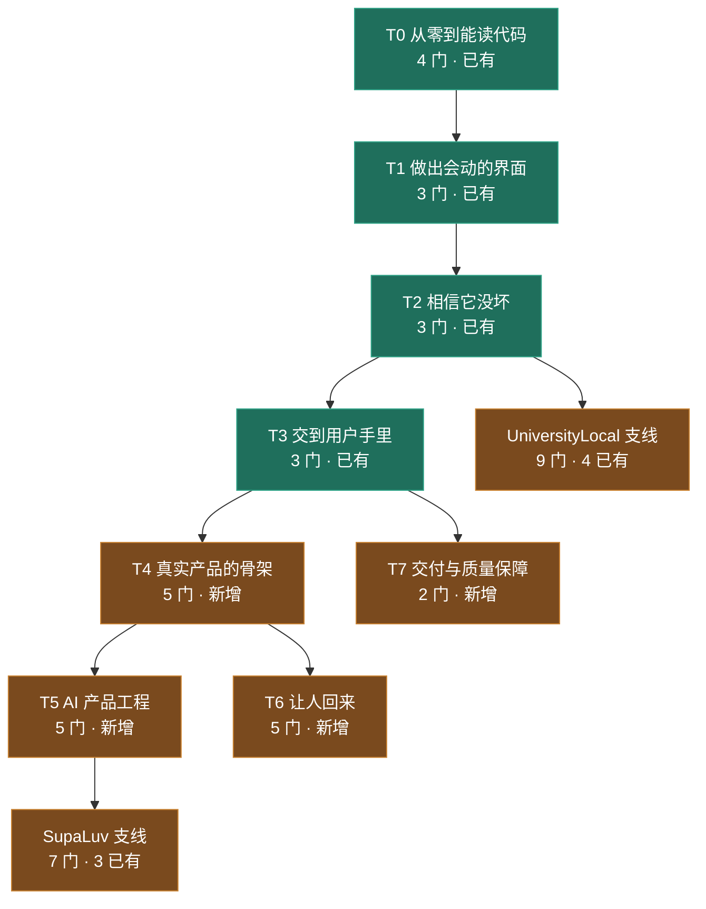

# 独立开发者课程地图（证据优先）

一个人的公司要学的东西，按**哪份真代码能证明它**来编排。

## 这份地图遵守的唯一硬规则

每节课都必须引用「某个 commit 上某个真实文件的某几行」——`validateEvidence` 会打开被学仓库核对 blob
真实存在，`EvidenceKind` 只有 `fact` / `inference`，两种都要求真文件。

所以本地图**只收有真代码可依的课**。这不是保守，是这个系统唯一值钱的地方：代码一改，
`evaluateEvidenceFreshness` 自动发现课文对不上，把它标成 stale。没有代码可依的题目
（定价策略、获客、法务、记账、客服、招人）暂缓——它们值得学，但硬塞进来只能伪造证据，
而伪造的证据**会通过全部结构检查**（这个项目被这种失败坑过两次）。

## 三个仓各自能教什么

| study | 源 | 它真正能背书的领域 |
| --- | --- | --- |
| `turing-pact` | TuringPact | 实时多人、AI 角色与编排、双语、三端交付、身份、合规、实验、留存、e2e/QA |
| `supaluv` | SupaLuv | AI 成本与计费、模型边界、生成式资产、分支叙事、自动试玩 |
| `university-local` | `.ul-airlock` | 内容治理、证据与新鲜度、间隔重复、本地数据边界、供应链隔离 |

## 阶段与依赖

## T0–T3 · 已有 13 门（不动）

`foundations-before-zero`(41 节) → `foundations-terrain` → `foundations-reading-code` →
`foundations-logic` → `foundations-data` → `foundations-async` → `foundations-ui` →
`foundations-quality` → `foundations-product`，另有 `contracts-and-drift`、
`one-codebase-many-hosts`、`state-and-process`、`testing-strategy` 四门专题挂在链尾。

## T4 · 真实产品的骨架（新增 5 门 · turing-pact）

| 课程 | 教什么 | 证据在哪 |
| --- | --- | --- |
| `identity-and-accounts` | 身份、登录态、邮件认证与「展示用身份 vs 真身份」的分离 | `src/services/auth/{authController,presentation,types}.ts`、`emailAuth.ts`、`src/features/player-identity/` |
| `bilingual-by-design` | 双语不是翻译表：命名空间怎么切、什么绝不能进翻译文件 | `src/i18n/config.ts`、`locales/{en,zh-CN}/{auth,common,game,puzzle}.json` |
| `realtime-presence` | 谁在线、谁在打字、断线重连——状态在多端之间怎么保持一致 | `src/features/{world-runtime,world-presence,live-room,chat-signals}/` |
| `platform-capabilities` | 同一个能力在 web/electron/capacitor 上三种实现，如何只写一次决策 | `src/platform/{haptics,share,statusBar,storage,safeLocalStorage,runtimeInfo}.ts` 及三端子目录 |
| `failure-recovery` | 用户网断了、chunk 加载失败了——产品怎么自己爬起来 | `src/platform/dynamicImportRecovery.ts` |

## T5 · AI 产品工程（新增 5 门 · turing-pact/mastra）★ 最高优先

| 课程 | 教什么 | 证据在哪 |
| --- | --- | --- |
| `ai-contracts-first` | 先定契约再接模型：网关、处理器、调度核心各自的边界 | `services/mastra/src/contracts/{ai-chat-gateway,ai-chat-handler,ai-scheduler-core}.ts` |
| `structured-output-repair` | 模型输出不可靠时怎么拿到可靠结构：错误码分类、修复标记、哪些错该重试 | `services/mastra/src/contracts/agent-decision.ts` |
| `ai-budget-and-cost` | 一次对话到底花多少钱，以及预算怎么在调用前就把闸拉下 | `services/mastra/src/runtime/{ai-budget,model-cost}.ts` |
| `ai-evaluation` | 「我的 AI 够好吗」怎么变成可重复的分数 | `services/mastra/evals/{m1-baseline,m2-dialogue-quality}.json`、`src/evals/m1-scorers.ts` |
| `agent-identity-continuity` | 让 AI 角色前后像同一个人：身份连续性与说话风格信号 | `services/mastra/src/orchestration/{identity-continuity,message-style-signals,decision-quality}.ts` |

## T6 · 让人回来（新增 5 门 · turing-pact）

| 课程 | 教什么 | 证据在哪 |
| --- | --- | --- |
| `experiments-and-rollout` | 先登记再上线：实验注册表与灰度 | `src/features/experiments/` |
| `retention-engineering` | 留存不是发推送，是给人一个回来的理由 | `src/features/{return-hooks,daily-puzzle}/` |
| `compliance-and-gating` | 年龄门槛、举报、必须登录才能做的事 | `src/features/compliance/` |
| `moment-design` | 开场仪式、揭晓高潮、复盘——产品的「时刻」怎么用代码搭 | `src/features/{opening-ritual,start-presentation,unmask-climax,roast-report}/` |
| `world-navigation` | 大厅、传送门、房间话题：导航是产品结构的外化 | `src/features/{world-lobby,world-portal,world-callouts,room-topics}/` |

## T7 · 交付与质量保障（新增 2 门 · turing-pact）

| 课程 | 教什么 | 证据在哪 |
| --- | --- | --- |
| `e2e-and-qa-scripts` | 一个人怎么替代一个 QA 团队 | `tests/e2e/`(20)、`scripts/qa/`(36) |
| `asset-pipeline` | 351 个素材怎么进产品而不失控 | `public/assets/`、`scripts/world-assets/` |

## SupaLuv 支线（3 已有 + 4 新增）

已有：`founder-engineer`、`ai-cost-and-boundaries`、`generated-assets`

| 新增课程 | 教什么 | 证据在哪 |
| --- | --- | --- |
| `ai-branching-narrative` | 分支叙事怎么既有作者意图又容得下 AI | `services/ai-branch/`(54 文件) |
| `automated-playtesting` | 让机器替你玩一千遍 | `tools/auto-player/`、`artifacts/playtest/` |
| `media-tooling` | 抠像与语音预生成：一个人的媒体流水线 | `tools/{portrait-matte,voice-pregen}/` |
| `content-as-package` | 内容当依赖包管理 | `packages/content/`(173 文件) |

## UniversityLocal 支线（4 已有 + 5 新增）

已有：`how-this-campus-works`、`how-this-campus-works-2`、`four-layer-workbench`、`communicate-with-ai`

| 新增课程 | 教什么 | 证据在哪 |
| --- | --- | --- |
| `evidence-and-freshness` | 怎么让教材没法撒谎 | `server/content/evidence.ts`、`server/workflows/refresh-study.ts` |
| `spaced-repetition` | 遗忘曲线怎么变成一张 sqlite 表 | `server/learning/sqlite-learning-store.ts` |
| `local-first-boundaries` | 「资料仅在本机」不是口号，是 loopback + 0o600 + 拦外链 | `server/http-server.ts`、`src/MarkdownContent.tsx` |
| `airlock-supply-chain` | 学自己的代码为什么要先隔离 | `server/airlock/*.ts` |
| `content-governance` | 草稿、发布、过期、退休：教材的生命周期 | `server/content/repository.ts`、`server/workflows/revise-course.ts` |

## 总计

**已全部建成：45 门 / 478 节**（turing-pact 29 · supaluv 7 · university-local 9）。

比原计划少一门：`compliance-and-gating` 取消了。`src/features/compliance/` 只有 1 个文件，
而隐私红线、举报流程、年龄提示已经由 `foundations-product` 用同一批代码讲过——单开一门
只能靠注水凑课时，那正是这份地图开头拒绝的东西。

## 刻意不做的

定价策略、获客/SEO、法务合同、记账报税、客服流程、招人外包——这六类没有任何一个仓能提供
真证据。等工程课成型后再决定是新开一个教材 study，还是用 `personal-understanding` 知识笔记
承载。

## 执行记录

按证据密度与不可替代性依次交付，每批都独立跑过 shape 与 evidence 两道门禁，
并抽查课文论断与源码是否一致（门禁只验结构与行号存在，验不了课文说得对不对）：

1. **T5 AI 产品工程**（5 门 / 57 节）——最不可替代，真代码最密
2. **T4 真实产品的骨架**（5 门 / 59 节）
3. **UniversityLocal 支线**（5 门 / 57 节）
4. **T6 让人回来**（4 门 / 47 节）
5. **SupaLuv 支线**（4 门 / 45 节）
6. **T7 交付与质量保障**（2 门 / 24 节）

全部课程的先修关系已接通，书架顺序由依赖图自动算出，不靠人工排位。
