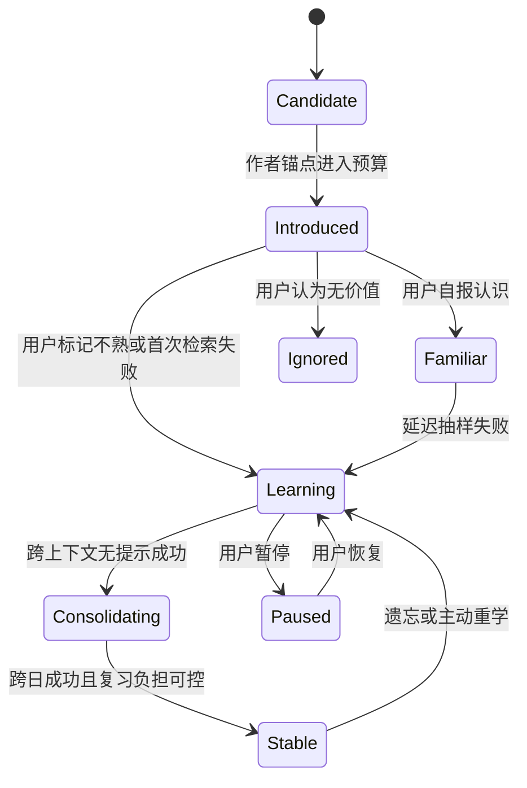
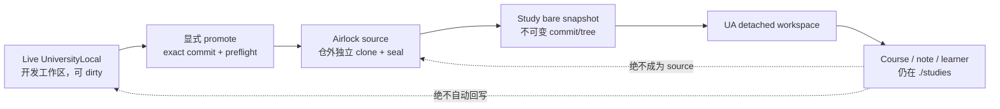

# UniversityLocal 下一阶段进化研究（Sol · 2026-08-06）

> 本文是研究结论，不是已批准的 SPEC、PLAN 或实现承诺。文中出现的阈值均会明确标成
> “实验起点”，不能当作学习科学常数。用户原话中的“净化”按上下文理解为“进化”。

**交付状态（2026-08-08）：** 下文「推荐顺序」中的 airlock、外语旁注层核心、
`comm-coach` 使用路径均已落地（产品名外语模式；合成层见
`server/language/`）。勿把文中「尚未实现」「Web 没有英文模式」等**研究当时**
的陈述当成现状。现状索引：`docs/reference/execution/current-work.md`。

## 0. 结论先行

三个方向都值得做，但不能按表面形态直接实现。

| 方向 | 结论 | 现在最重要的边界 |
| --- | --- | --- |
| 教程内英文模式 | **有条件做小规模实验** | 不是随机替词；默认关闭；主课不被英语闸门阻塞；“看见/点击”不等于掌握 |
| 沟通能力 | **技能已经在，先接通使用路径，再建课程** | 不监听整段对话；事实教学与表达教练分工；AI 沟通和人际沟通有公共底座但不是同一种能力 |
| 学习 UniversityLocal 自身 | **可以做，而且不会天然无限递归** | 不放宽 source/studies 重叠守卫；优先用仓外独立、sealed 的 airlock 源镜像；只学明确提交 |

最关键的独立判断有四条：

1. **不能“强迫学会”，只能保证高质量练习机会。** 像健身房可以安排动作、重量和休息，
   但不能保证每个人做完十次就长出同样的肌肉。真正可靠的办法是默认可撤销、小样本试验、
   延迟测试和停止条件。
2. **英语“出现频率”不是一个数字。** 它至少混合了每课新词数、同时在学的词数、每段出现
   上限、难度和每日复习负担。只做一个“英文百分比”滑块，会给出虚假的精确感。
3. **沟通教练不自动出现是当前设计的结果，不是技能失效。** 它像需要预约的私教，只练用户
   明确选中的一段样本；当前缺的是门铃、路牌和课程接缝。
4. **自学习的主要问题是输入输出拓扑，不是数学递归。** 把昨天已提交的 UniversityLocal
   放进一间隔离教室分析，类似“编译器编译自己的下一版”；只有学习产物被自动写回输入并
   立即再次触发分析，才会形成失控反馈环。

### 推荐顺序

1. 先完成 `current-work` 已定义的真实学习会话证明，留下英文模式 OFF 时的主课基线。
2. 立即补足 `comm-coach` 的可发现用法；这一步不需要新运行时。
3. 实现 self-study airlock 的 doctor/promote/freshness，再注册自身 study。
4. 用 4–6 节课、12–20 个手工词义槽做英文模式非劣实验。
5. 有真实练习证据后，再决定词汇全局状态和正式沟通课程的数据模型。

## 1. 研究方法与置信度

本文同时使用三层证据，避免把推断写成事实：

| 标签 | 含义 | 例子 |
| --- | --- | --- |
| **已证实** | 当前代码、技能、配置、测试或一次安全模拟直接证明 | 默认根重叠会被拒；`comm-coach` 已安装 |
| **设计判断** | 基于当前约束与成熟模式得出的推荐 | 使用 airlock，而不是 self-host 重叠例外 |
| **待实证** | 只有真实用户试验才能回答 | 何种英文密度不伤害技术理解 |

外部学习科学优先采用元分析、系统综述、标准组织和官方项目资料。技术 donor 只使用官方仓库
或官方文档核对。本文也审阅了同目录下 Grok 与 Opus 的平行草稿；它们是非规范性研究输入，
其中的“业主已锁定”不能替代本次对话，也不能覆盖代码事实。

### 关于“100% confidence”

对开放世界的软件和人的学习效果承诺 100% 无漏洞，是不诚实的。可以达到的是：

- 对**当前事实**做到可重复核验；
- 对**架构边界**列出已知故障路径并用测试关闭；
- 对**学习效果**只做可回滚实验，不把猜测包装成结论。

本文末尾给出了完整漏洞审计。当前没有已知的致命设计漏洞未给出处理路径，但英语效果、沟通
迁移、不同宿主的数据处理方式仍必须靠真实运行验证。

## 2. GoalCascade：先决定产品角色，再决定功能

| 层 | 本阶段答案 |
| --- | --- |
| 使命 | 让一个初学者用可靠证据学会项目，并把知识迁移到英语阅读、AI 协作和真实工作表达中 |
| 产品角色 | 本地个人大学；不是通用语言 App、绩效评分器、心理咨询师或云端学习平台 |
| 未来 4–8 周阶段目标 | 证明三件事：副线不伤主课、自身 study 可安全刷新、沟通练习能形成“尝试—反馈—重试”闭环 |
| 当前目标用户 | 本项目所有者：编程仍在打基础，英文已有一定基础，重视与 AI 协作和长期积累 |
| 明确非目标 | 多用户班级、考试认证、全量通用英语、自动监控员工沟通、云同步、自动提交源码 |
| 胜出逻辑 | 用正在学习的真实项目语境做迁移；保持证据、学习状态和运行控制面分离 |
| 成本边界 | 主要预算不是钱，而是注意力、每日复习分钟、本地存储、内容审核和维护复杂度 |
| 原则 | 主课优先、显式同意、默认关闭、不可变证据、同一调度器、物理隔离、拒绝伪掌握 |

### 明确拒绝项

- 随机把中文 token 替换成英文；
- 用点击次数、页面浏览或“我认识”一次点击判定掌握；
- 每个单词都自动生成卡片；
- 全会话自动沟通评分、固定八维雷达图或长期“沟通分”；
- 为英语或沟通再造一套间隔算法；
- 给 self-study 加一个 metadata 开关就绕过根目录隔离；
- 让快照中的 skill 或生成文档自动改变 live 控制面；
- 在没有真实效果证据前铺满全部课程。

## 3. 当前系统：已经有什么，缺什么

### 3.1 已证实的架构事实

| 事实 | 代码证据 | 含义 |
| --- | --- | --- |
| 默认书架是项目内 `./studies` | `university-local.config.json:1-4` | 正常学习外部项目没问题，但源设为本仓时会重叠 |
| source 与 studies 双向包含都会拒绝，且先解析 realpath | `server/config/load-config.ts:59-88,124-133` | 符号链接不能绕过；这是安全不变量 |
| 注册源会解析 Git top-level 后再次执行分离检查 | `server/studies/repository.ts:161-188` | 当前直接注册 UniversityLocal 必然失败 |
| 快照只抓精确 commit/tree，不抓全部 refs | `server/studies/snapshots.ts:142-219,222-273` | dirty/untracked 不进入教材；同 commit 可复用 |
| 外部 symlink 会被记录并从 UA 工作区移除 | `server/studies/snapshots.ts:82-128`; `server/ua/adapter.ts:226-265` | PGS 管理的 skill 链接本身可见，但目标内容不会被 self-study 摄入 |
| UA 在 detached worktree 中运行并在结束后清理 | `server/ua/adapter.ts:267-319,543-600` | 分析不应写 live source |
| lesson、exercise、card 都要求固定证据 | `src/domain/schemas.ts:227-286` | 沟通课和词义不能拿网页 URL 或“常识”冒充源码证据 |
| 练习只有 `short-answer` 与 `explain`；卡片只有 `basic` 与 `cloze` | `src/domain/schemas.ts:245-286` | 目前没有词汇或沟通练习实体 |
| review identity 只有 course-card 与 knowledge-card | `server/learning/types.ts:30-37,114-134` | “复用 FSRS”不等于现有 schema 能无改动接纳单词 |
| Web lesson 是 Markdown → exercises → 完成后 cards | `src/App.tsx:992-1041` | 当前没有设置、词义弹层、宿主教练桥接 |
| Markdown 只有 GFM、链接/图片安全和 Mermaid 定制 | `src/MarkdownContent.tsx:44-104` | 自动替词、语义槽和语言标记都尚不存在 |
| `explain` 是用户自评，不是 AI 反馈 | `src/App.tsx:589-750` | 正式课可练事实复述，但不能假装已有沟通教练反馈 |
| 完整练习答案会进入 SQLite | `server/learning/sqlite-learning-store.ts:631-640,1561-1625` | 真实同事、绩效或冲突对话不应直接复用此持久化路径 |
| `learner_setting` 表存在，但没有产品读写契约 | `server/learning/sqlite-learning-store.ts:695-699` | 不能宣称英文开关已经有现成设置 API |

### 3.2 沟通技能的真实状态

`.agents/skills/comm-coach` 已经是指向 PGS canonical skill 的项目级符号链接；
`.claude/skills` 又指回 `.agents/skills`。技能当前支持：

- expression clinic：点评一段明确样本；
- roleplay：短回合角色扮演；
- teach-back：事实已核对后，只练复述的清晰度和结构。

它明确要求一次只练一个样本、不给全会话做未经同意的扫描、不自动保存、只给 1–2 个最高
杠杆改进，并要求用户重试。见 `.agents/skills/comm-coach/SKILL.md:8-57`。

`teach-from-study` 已规定正确顺序：事实准确性归教学技能；只有用户请求表达反馈时，先核实事实，
再调用沟通教练，而且默认不同时启动。见 `.agents/skills/teach-from-study/SKILL.md:21-36`。

真正的缺口是使用指南没有介绍它。现有指南把 AI host 比作老师、Web UI 比作课本/题册/复习桌，
但只介绍教学、知识保存和刷新，没有沟通教练入口（`docs/reference/using-university-local-with-grok.md:77-93`）。

## 4. 方向一：教程里的英文模式

### 4.1 重新定义目标

不是“在中文里随机冒英文”，而是：

> 在不改变主课完成条件的前提下，把少量、高价值、语义明确的英语词义或短语锚定到真实技术
> 语境；用可点释义降低理解成本，用延迟检索判断记忆，再把确实需要复习的条目送入同一 FSRS。

这里的学习单位应是 **lexeme + sense + phrase**，不是裸字符串。例如：

- `commit` 在 Git、数据库和日常英语中不是同一个 sense；
- `failure mode`、`source of truth`、`trade-off` 往往比单独背 `failure/source/trade` 更有用；
- `record` 作名词和动词时读音可能不同，不能只按拼写选发音。

### 4.2 需要纠正的五个直觉

1. **多看几次不是掌握。** 看见一个人的脸十次，不等于遮住照片后能叫出名字。页面呈现只能记为
   `presented`，不能记为“看见”，更不能自动记为 `Good`。
2. **点击释义不是失败。** 用户可能只想听发音或确认技术义；扬声器点击、释义展开、主动标记“不熟”
   必须是不同事件。
3. **“我认识”不是终身毕业。** 它可以暂时降低骚扰，但需要以后在不同上下文做一次无提示抽样。
4. **CEFR 不是官方通用词表。** 欧洲委员会把 CEFR 定义为非规定性的能力框架；具体英语词表由不同
   团队做 Reference Level Descriptions，不能把第三方标签写成“官方等级”。
   见 [Council of Europe: CEFR is non-prescriptive](https://www.coe.int/en/web/common-european-framework-reference-languages/introduction-and-context)
   和 [language-specific RLDs](https://www.coe.int/en/web/common-european-framework-reference-languages/reference-level-descriptions)。
5. **“强迫”应改成承诺内练习。** 主课阅读时不阻塞；用户明确加入复习后，到期检索可以要求先回答再揭示。

### 4.3 学习科学给出的方向，不给出的魔法数字

| 证据 | 能支持什么 | 不能支持什么 |
| --- | --- | --- |
| 2023 年 incidental vocabulary 元分析：24 项研究、2,771 人，即时学得比例约 9–18%，延迟约 6–17% | 纯“顺便看见”会有收益，但通常不足 | 不能承诺自然重现几次就学会。[原文](https://www.cambridge.org/core/journals/language-teaching/article/how-effective-is-second-language-incidental-vocabulary-learning-a-metaanalysis/E38E3468FD2090B1FA3051051DE8E70C) |
| 2020 年 glossing 元回归：42 项研究、3,802 人；有注释阅读优于无注释 | 点击式、当前语境的一义释义值得做 | 不能证明塞更多模态一定更好。[原文](https://www.cambridge.org/core/journals/studies-in-second-language-acquisition/article/abs/how-do-different-forms-of-glossing-contribute-to-l2-vocabulary-learning-from-reading/38124150D59DF3039EE1FF5AE88FE922) |
| 2019 年重复暴露元分析：26 项研究、1,918 人，平均相关约 `r=.34`，并受间隔、视觉支持、参与度等调节 | 重复重要，但上下文和参与方式同样重要 | 不能把“10 次”变成所有词、所有人的固定毕业线。[原文](https://onlinelibrary.wiley.com/doi/abs/10.1111/lang.12343) |
| 二语间隔练习元分析 | 长期保持需要跨时间分散 | 不能从论文直接抄一个固定小时数。[原文](https://onlinelibrary.wiley.com/doi/full/10.1111/lang.12479) |

这些研究大多研究 L2 阅读，而本项目是“中文技术教程中稀疏嵌入英语”。因此它们能指导设计方向，
不能替代本用户的非劣实验。

### 4.4 推荐的内容模型：作者标注语义槽，不做运行时猜词

推荐采用两层结构：

1. **课程内稳定 anchor**：作者审核后，在 Markdown 放一个有稳定 ID 的语义 directive，包含中文回退；
   这是一次正常课程修订。
2. **版本化 lexicon 条目**：保存 lemma、特定 sense、词性、当前语境中文义、IPA、发音来源、许可和难度先验。

模式关闭时，anchor 只渲染中文回退；模式打开时，渲染经状态机选中的英文。用户调密度、学会一个词或
刷新页面时，课程 Markdown、`contentHash` 和 `contentRevision` 都不变化。

可采用 MIT 的 [`remark-directive`](https://github.com/remarkjs/remark-directive) 解析受控语义标记；
它与当前 `react-markdown`/remark 栈直接匹配。不要用正则或 `mdast-util-find-and-replace` 自动替换所有
同拼写文本：成熟的 AST 工具能解决“在哪里替换”，解决不了“这一处到底是哪一个词义”。

明确排除：代码块、inline code、标题、链接文本、证据原文、文件路径、命令和用户输入。证据引用被改写，
就像在法庭证物上贴了新的标签后再说“这是原样”。

### 4.5 学习状态机



`Familiar` 是“暂时少打扰”，不是 `Stable`。`Stable` 也不等于永久掌握，只表示停止特殊高亮、释放新词
名额；若已加入 FSRS，它仍按调度到期。

### 4.6 用户能调什么

用户界面可以保持简单，但内部不能只存一个百分比。

| 用户设置 | 内部含义 |
| --- | --- |
| 开关（默认关） | 全局关闭时与今天的课程体验一致 |
| 难度 | 通用频率/粗等级先验 + 当前课程专业相关度；两条轴不能混成一个“高级词” |
| 密度：轻 / 中 / 高 | 每课新词义预算、同时学习池、每段出现上限的组合 preset |
| 每日英语复习预算 | 到上限后停止引入新词，不挤压技术知识卡 |
| 发音 | 本地语音 / 仅 IPA；不提供静默云端降级 |

可以把以下数值作为 **MVP 实验起点**，不是产品定律：

| preset | 每课新词义 | 同一小节上限 |
| --- | ---: | ---: |
| 轻 | 1–2 | 1 |
| 中 | 2–4 | 1 |
| 高 | 4–6 | 2 |

选择必须在同一 lesson revision 和 session 内稳定；重新渲染不能随机换词。页面呈现事件应幂等，不能靠
多次刷新刷出“学习次数”。复习积压或主课表现下降时，自动减少新词，而不是改变 FSRS 公式。

### 4.7 点击后的体验

第一层只显示：

- 当前语境的一义中文；
- 词性或短语类型；
- IPA；
- 显式播放；
- “这个意思不熟 / 加入复习 / 暂不学习”。

不要首屏同时堆中文、长英文定义、图片、三个例句、词源和音频。英文文字应标 `lang="en"`；触发器用
语义化 button，支持 Enter/Space、Esc 关闭和焦点返回。W3C 要求页面中的语言变化可被程序识别，
这会影响屏幕阅读器的发音规则；Disclosure pattern 也明确了 button 与 `aria-expanded` 的键盘契约。
见 [WCAG Language of Parts](https://www.w3.org/WAI/WCAG22/Understanding/language-of-parts.html)、
[WAI Disclosure Pattern](https://www.w3.org/WAI/ARIA/apg/patterns/disclosure/) 和
[WCAG Pronunciation](https://www.w3.org/WAI/WCAG22/Understanding/pronunciation.html)。

当前 SwimmerUIKit 的 `GameTooltip` 只有 label 和一个触发器，不适合承载播放、加入复习等可聚焦控件。
优先给共享 UI 层补 rich popover/disclosure；实现底层可评估浏览器原生
[Popover API](https://developer.mozilla.org/en-US/docs/Web/API/Popover_API) 或 MIT 的
[Floating UI](https://floating-ui.com/docs/popover)，不要在项目里手写碰撞定位和焦点管理。移动端应降级为
bottom sheet/dialog，而不是把窄弹层挤出屏幕。

### 4.8 发音与 local-only

MVP 推荐顺序：

1. 已审核许可、随包保存的本地真人音频；
2. 浏览器返回并确认 `localService` 的英语 `SpeechSynthesisVoice`；
3. 仅显示 IPA。

播放必须由用户点击，绝不自动播放。MDN 只说明 `SpeechSynthesis` 可列出设备上的可用 voice，并不保证
每个平台、每个 voice 都有相同质量或隐私行为，因此必须做实际浏览器与断网测试，不能把 Web Speech
宣传成无条件离线。见 [MDN SpeechSynthesis](https://developer.mozilla.org/en-US/docs/Web/API/SpeechSynthesis)。

可把 [CMUdict](https://github.com/cmusphinx/cmudict) 用作美式 ARPABET 发音校验，但它没有释义和音频，
也不是直接面向用户的 IPA 数据源。Apache-2.0 的 [Kokoro](https://github.com/hexgrad/kokoro) 可作为未来
本地 TTS donor，但模型资产、首次加载、设备性能和语音 QA 都远大于一个词的播放需求，MVP 不引入。

### 4.9 复习：混合方式，不是“全做卡”或“完全不做卡”

推荐三层：

1. **语境再遇**：自然出现，不计为成功复习；
2. **小节边界微检索**：2–5 秒、答案先隐藏、可跳过，不阻塞主课；
3. **FSRS 到期复习**：只有用户主动加入或延迟检索失败的词义进入。

“复用现有 FSRS”是正确方向，但不能假装现有 card schema 已经支持词汇。当前 course card 要求课程层级和
证据，review key 也只有两种。长期有两个合法选项：

| 选项 | 优点 | 代价 |
| --- | --- | --- |
| 增加 `vocabulary-card` content identity，共用同一个 LearningStore/Today/ts-fsrs | 语义最清楚；不是第二套调度器 | 需要正式 schema、revision、provenance 和迁移设计 |
| 建一个有固定词典证据的 `language-lab` study，所有课程 anchor 引用其 stable lexeme/card | 最大化复用现有 course/card/FSRS；词汇状态天然跨课程 | 需要明确的跨 study 引用与写入契约 |

建议先用 12–20 个条目实验，不在实验前仓促锁死全局数据模型。必须提前承认一个现有架构缺口：learner DB
按 study 分开，同一个词跨多个 study 的全局掌握状态今天并不存在。

### 4.10 词典与 donor 选择

| donor | 许可/状态 | 建议 |
| --- | --- | --- |
| `ts-fsrs` 5.4.1 | 项目已安装；成熟 TypeScript FSRS | **直接复用调度**，不改算法 |
| `remark-directive` | MIT；unified 生态，当前 npm 主线活跃 | **直接评估**语义 anchor 解析 |
| Open English WordNet | CC BY 4.0；有稳定 sense graph | 用于 sense ID/英文定义校验，不把英文长定义当中国初学者成品。[仓库](https://github.com/globalwordnet/english-wordnet) |
| Wiktextract + Kaikki | extractor 为 MIT；派生词典和每个音频资产有各自许可 | 只能导入固定小子集并保存来源/作者/许可；不能把工具的 MIT 当数据许可。[仓库](https://github.com/tatuylonen/wiktextract) / [数据](https://kaikki.org/dictionary/rawdata.html) |
| NGSL | CC BY-SA 4.0；通用高频先验 | 可做初级候选，不等于 CEFR。[官网](https://www.newgeneralservicelist.com/new-general-service-list) |
| `wordfreq` | Apache 代码 + 多源数据；作者说明数据停在约 2021，且 Python-only | 仅作研究先验；不做当前产品事实源。[仓库](https://github.com/rspeer/wordfreq) |
| Lute v3 / LinguaCafe | MIT / GPL-3；成熟阅读交互 | 借“点击词—状态—复习”模式，不移植整 App。[Lute](https://github.com/LuteOrg/lute-v3) / [LinguaCafe](https://github.com/simjanos-dev/LinguaCafe) |

第一版最安全的词库不是几十万词，而是 12–20 个由课程作者审核、带具体 sense 和自然后续复现位置的
技术词/短语。自动 NLP 抽词只生成 proposal，永远不直接进正式课。

### 4.11 实验与停止条件

**Gate 0：内容和交互 QA**

- 4–6 节课、12–20 个手工词义；
- 每处检查语法自然、多义词、代码/链接/证据排除；
- 键盘、屏幕阅读器语言、390px、小屏 dialog、断网发音；
- 运行时外部请求为 0。

**Gate 1：主课非劣，N-of-1 ABBA**

- 选 8–12 节相近课程，OFF 与 LOW 交替；目标词集合隔离；
- 主指标：主课题首次正确率、完成时间、放弃/返回、1–5 打断感；
- 实验起点：正确率下降小于 5 个百分点、完成时长中位增加不超过 15%、打断感中位不超过 2/5；
- 连续 3 课下降超过 10 个百分点、耗时增加超过 25%、超过半数课程后主动关闭，立即停止扩展。

**Gate 2：证明英语机制**

- 在 LOW 内比较“只有注释”与“注释 + 延迟微检索”；
- 24 小时和 7 天做无提示意义回忆/上下文填空；至少 30 天后才称“较持久”；
- 复习中位预算先限制在 3 分钟/天，连续积压超过 5 分钟/天则停止引入新词。

阈值是决策护栏，不是统计显著性声明；单用户结果只适用于本用户，不可包装成普遍学习定律。

## 5. 方向二：沟通教练、教程和课程

### 5.1 现在就能怎么用

无需改代码，在任一支持项目技能的 host 中可以直接说：

```text
用 $comm-coach 点评下面这段给 AI 的请求。
目标：让它先研究再给可验证方案。受众：Codex。约束：不要替我提交代码。
先说一个做得好的地方，只给 1–2 个最高杠杆修改点，然后让我重写。
---
（粘贴你的版本）
```

```text
你来扮演只关心发布日期的产品负责人。
我要沟通延期，做 4–6 回合 roleplay；到自然停顿后点评我的开场，并让我重说一次。
```

```text
我先复述刚学的 fail-closed。
请用 teach-from-study 核对事实；事实过关后，问我要不要切换 comm-coach，只练清晰度和结构。
```

这三种用法分别对应 expression clinic、roleplay、teach-back。用户说“帮我润色”若只要成品，不会自动进入
教练；要练能力，应明确要求“指出原因并让我重写”。

### 5.2 AI 沟通和人际沟通：共用底盘，分开驾驶

公共底座是：意图、受众、必要上下文、约束、可观察反馈、修正和重试。

| 与 AI 协作更重要 | 与人协作额外需要 |
| --- | --- |
| 明确目标/非目标、证据、输出形状、验收、工具权限 | 倾听、关系、权力差、情绪、承诺、时机、修复和对方自主性 |
| 可以廉价重试；模型没有真实利益 | 每次表达都会影响信任，不能把同事当成可编程 API |

类比：给机器人遥控器写指令，重点是无歧义；和同事搬桌子，除了说方向，还要看对方是否听见、是否有
不同信息、是否愿意承担这件事。把 prompt 模板原样用于人，可能显得控制欲强。

### 5.3 推荐三层集成

**L1：现有即时教练——现在即可用**

- 用指南和示例提升可发现性；
- 保持只分析明确选中的样本；
- 保持“一个优点 + 1–2 个改进 + 立即重试”。

**L2：教程里的可拒绝邀请——优先产品桥**

- 只有课程作者标注的 checkpoint 才出现“练表达（可跳过）”；
- 先由 `teach-from-study` 核事实，再询问是否切换 `comm-coach`；
- 只在课末、完成一段回答后或用户主动点按钮时出现，不在主任务中途打断；
- 频率设置控制“邀请出现次数”，绝不控制“后台扫描多少聊天”；默认“仅手动”。

当前 Web UI 没有调用 AI host 的安全通道，也不应为此直接接模型 API。MVP 应生成一段可复制 prompt，
包含目标、受众、约束、用户主动选择的回答和 evidence locator，由用户交给当前 host。

**L3：正式小课程——有证据后再建**

建议从一门紧凑 foundation 起步：

1. 公共底座：意图、受众、上下文、请求、反馈；
2. AI 轨：目标/非目标、证据与不确定性、输出形状、验收和迭代；
3. 人际轨：结论先行、状态更新、明确请求、观察—影响—请求、倾听；
4. 桥接：把同一个意图分别写给 AI 和同事，指出哪些结构可迁移、哪些会失效；
5. teach-back：30 秒版和 3 分钟版，事实层与表达层分两次反馈。

每课的核心不是背框架，而是：worked example → 首次尝试 → 一项行为目标 → 反馈 → 重试 → 以后换场景迁移。

### 5.4 课程与技能不能互相冒充

| 层 | 负责什么 | 不负责什么 |
| --- | --- | --- |
| `teach-from-study` | 项目事实、证据、概念纠错 | 不默认评表达风格 |
| `comm-coach` | 一段样本的表达观察和练习反馈 | 不改项目事实，不扫描全会话 |
| 正式 course | 渐进 syllabus、worked examples、固定练习 | 不自动获得 AI 反馈能力 |
| FSRS cards | 记住框架线索和原则 | 不能证明真实沟通能力 |
| 场景练习 | 程序性能力和迁移 | 不产生全局“沟通分” |

自我解释研究的元分析汇总 64 份报告、69 个效应，随机效应平均约 `g=.55`，支持在教学中加入
teach-back，但这不等于所有复述都会自动正确。见
[Bisra et al., 2018](https://eric.ed.gov/?id=EJ1186664)。一份医学教育领域的 Cochrane 综述显示，
个性化、具体反馈可能比泛泛反馈更有帮助，但研究异质性很高，角色扮演形式之间的优劣仍不确定；它只能
方向性支持“具体反馈 + 重试”，不能直接外推成软件工程沟通的固定分数。
见 [Cochrane review](https://www.cochrane.org/evidence/CD012418_communication-skills-interventions-medical-students)。

### 5.5 证据和课程来源

正式 lesson/card/exercise 都要求同一 study 的固定 snapshot 证据。不能把几篇网页 URL 随手拼进 proposal。
可行路径按优先级是：

1. 把许可证清楚、Markdown 结构合适的 donor 注册成 communication study；
2. 建一个 UniversityLocal-owned、保留来源和许可的 curated communication source repo，再固定快照；
3. 若未来必须在同一内容中引用多个 study，再单独设计 multi-source evidence；现在不放宽合同。

重要盲点：UniversityLocal 的 `.agents/skills/comm-coach` 是指向 PGS 的外部 symlink。当前 snapshot 会排除
外部 symlink，所以“UniversityLocal 学自己”**不会**自动读到沟通教练的真实正文。要讲这个技能本身，
应单独注册 PGS 或建立明确、经审核的本地适配文档；不能说 self-study 已经解锁了它。

| donor | 许可/状态 | 采用方式 |
| --- | --- | --- |
| [GitHub how-engineering-communicates](https://github.com/github/how-engineering-communicates) | CC BY 4.0；工程异步沟通教材 | 适合作为首个 Git study；保留归因，补足其对困难对话和 AI 协作的缺口 |
| [DAIR.AI Prompt Engineering Guide](https://github.com/dair-ai/Prompt-Engineering-Guide) | MIT；大而活跃 | 精选基础章节并固定 commit；不整库照搬，不把易漂移的模型技巧当永恒规律 |
| [GovTech CO-STAR](https://www.tech.gov.sg/technews/mastering-the-art-of-prompt-engineering-with-empower/) | 官方公开框架 | 作为一个可选结构；官方 playbook 本身也强调按需组合，不当万能咒语 |
| [CommCoach research prototype](https://arxiv.org/abs/2505.14452) | 论文/原型 | 借“场景—对话—反馈”和可编辑情境，不声称有可直接安装的成熟包 |
| [H5P Branching Scenario](https://github.com/h5p/h5p-branching-scenario) | MIT；成熟场景图 | 借 branch authoring pattern；H5P runtime 与当前栈不合，不引入整套 |
| [Promptfoo](https://github.com/promptfoo/promptfoo) | MIT；活跃模型评测/红队框架 | 只借 scenario matrix、版本对比和 criteria；不作为本地学习 runtime，它可调 provider 且自定义 hook 可执行代码 |

### 5.6 隐私与保存

现有 `explain` 会持久化完整回答。因此：

- 课程内只用虚构或脱敏工作场景；
- 真实绩效、同事冲突、HR、法律或健康内容默认在 host 中临时练，不写 `exercise_attempt`；
- 练完只在用户明确同意后保存最小 receipt：scenario ID、目标技能、尝试次数、同任务 criterion、下一次练什么；
- 原始 transcript 默认不保存；若用户明确要求，只存一小段脱敏 before/after；
- `knowledge-node` 只保存重新组织后的原子经验，不保存整段聊天。

还要提醒：local-only 表示 UniversityLocal 不上传到自己的后端，不表示 host 模型提供商一定看不到上下文。
现有指南已要求学习私有项目之前检查 host 的 privacy policy
（`docs/reference/using-university-local-with-grok.md:356-364`）。

### 5.7 怎么判断“沟通变好了”

不要做总分。每次只围绕当前目标定义 3–5 个可观察 criterion，例如：

- 第一段是否出现清楚结论或请求；
- 是否把事实、推断和未知分开；
- 对方是否知道下一步由谁、何时做；
- 是否给对方留下澄清或不同意见的空间。

比较同一任务的 before/after，并在几天后换一个近迁移或远迁移场景。现实结果由用户反思：“是否得到明确
决定？是否减少反复澄清？对方能否复述共识？”AI 只能给形成性假设，不能当人际关系裁判。2026 年一项
预注册研究提示，奉承型 AI 反馈可能提高用户“自己肯定正确”的确信并降低修复冲突的意愿，因此教练必须
主动追问对方视角、未知信息和可修复动作。见 [PubMed record](https://pubmed.ncbi.nlm.nih.gov/41886588/)。

## 6. 方向三：让 UniversityLocal 学习自身

### 6.1 现在为什么失败

默认：

```text
sourceRoot  = /Users/yuanfei/PieAI/UniversityLocal
studiesRoot = /Users/yuanfei/PieAI/UniversityLocal/studies
```

`assertSeparatedRoots` 拒绝任何一方包含另一方，注册流程又必经该检查。因此直接注册不是“可能递归”，而是
今天就会 fail-closed。测试也覆盖真实路径和 symlink 解析后的重叠拒绝。

这个守卫不应被删除。`.gitignore` 只能保护尚未跟踪的文件；Git 官方明确说明，已经 tracked 的文件不受
ignore 影响。若有人 force-add `studies/**`、SQLite 或密钥，依赖“studies 被 ignore”就会失效。
见 [Git gitignore documentation](https://git-scm.com/docs/gitignore.html)。

### 6.2 推荐拓扑：独立 sealed airlock clone

保持现有 `./studies` 原地，在仓外建立一个独立、浅、干净、detached 的 UniversityLocal promotion checkout，
把它作为 study 的 `sourceRoot`。本文用临时目录做过一次无侵入注册模拟：内部 studies root + 仓外 Git source
成功通过当前 `registerLocalGitSource`，commit OID 长度与现有 schema 一致；无需放宽任何守卫。



正确心智模型：live 仓库是厨房，airlock 是验收台，study 是教室。只有厨师明确端上验收台、盖了 commit
章的菜才能进教室；教室作业不会自动倒回厨房当原料。

### 6.3 为什么 airlock 比另外几条路好

| 方案 | 判断 | 原因 |
| --- | --- | --- |
| **仓外独立、sealed clone** | **Phase 1 推荐** | 不迁现有学习数据，不改安全不变量，源/输出物理分离；磁盘代价当前很小 |
| 整个 studiesRoot 外迁 | 长期结构最纯，暂不作为前置 | 当前只有一个 root，会迁走全部 study；涉及 SQLite、UA 临时路径、备份与回滚 |
| locked detached worktree | 只适合短期实验 | `worktree lock` 防管理记录被 prune，不等于只读；仍共享 live `.git` object/config/admin |
| 多 studiesRoot | 暂缓 | Today 聚合、备份、发现和配置复杂度显著上升 |
| self-host overlap 窄例外 | **拒绝** | 破坏普适守卫，依赖 ignore 纪律，给删除 API、symlink、future watcher 留下危险组合 |

独立 clone 不应使用 `--shared`、alternates 或未 `--dissociate` 的 reference。Git 官方警告：shared clone 会
依赖源 object，源 GC 后可能损坏；本地 clone 默认还可能使用 hardlink，并可能与源并发修改竞争。首选
`--no-local` 或明确复制对象的浅 exact-commit promotion。
见 [Git clone documentation](https://git-scm.com/docs/git-clone.html)。

### 6.4 airlock 不是“手工 clone 一次”

如果只 clone 后忘记更新，系统会非常安全地教你旧代码。因此必须有 `doctor/promote/status` 契约和 seal：

| seal 字段 | 用途 |
| --- | --- |
| upstream canonical root/common-dir/object format | 防止同一路径后来被换成另一个 repo |
| allowed ref、previous/promoted commit、tree | 防止悄悄 rewind 或混淆历史 |
| promotedAt、tool/promoter version | 可审计 |
| self-study profile/version | 知道实际分析了哪些文件 |
| sensitive-path/secret/size scan receipt | 证明 import 前做过边界检查 |

airlock HEAD/tree/clean 必须在每次 refresh 前和 seal 完全一致；不一致就 BLOCKED。chmod 只能防误操作，不是
身份或安全边界，同一用户随时能改回来。

状态页必须显示三只钟：

1. live upstream HEAD 与 dirty；
2. airlock promoted baseline；
3. active course snapshot/analysis。

“course 对 airlock 当前”与“airlock 比 live 落后 N commits”必须分开写。live dirty 默认阻止 promote；若用户
明确同意只取当前 commit，receipt 仍要写明 dirty 文件未进入。只在 milestone commit 手动 promote，反而有利于
课程稳定；绝不能 filesystem watch 后自动拉取。

### 6.5 单向控制面

- 快照中的 `.agents/skills/**` 只能作为学习数据，不能动态加载执行；真正授课用可信 live skill，并记录版本/hash。
- `courses/`、`learner/`、UA data 永远不写回 live 或 airlock。
- `course-proposals/**`、研究文档等派生物只有经人审核并 commit，才在下一代成为输入；这是显式晋升，不是递归。
- 同一 commit + 同一 profile + 同一工具版本应复用同一分析；输出变化不应触发新 refresh。

这与 Bazel 的 hermeticity 和输出分离原则一致：正确性来自声明输入、稳定配置、隔离执行和工作区外输出。
见 [Bazel glossary: Hermeticity / Output base](https://bazel.build/reference/glossary) 与
[Reproducible Builds](https://reproducible-builds.org/docs/deterministic-build-systems/)。Git 官方的 detached
worktree 是 UA 临时分析区的成熟 donor，但不等于长期 airlock 应共享 live Git 元数据。
见 [git-worktree](https://git-scm.com/docs/git-worktree.html)。

### 6.6 self-study 特有和被放大的风险

| 风险 | 当前/推断 | 处理 |
| --- | --- | --- |
| force-added `studies/**`、`.env`、PEM、SQLite 进入 commit | 当前没有 exact-commit 隐私 gate | promote 前对 tracked tree 做 denylist、secret、blob-size 预检；日志脱敏 |
| airlock 永久落后 live | airlock 新增风险 | 三层 freshness + 显式 promote receipt |
| 同一个 UA analysis 被两个 host 同时运行 | 当前 `preparing` 可被重复 resume | owner lease/heartbeat；第二个返回 BUSY；显式 takeover |
| 旧 course 仍 active | 当前 active 不等于跟随最新 ref | 区分 `follow-ref` 与 `pinned-history`；UI 明示历史课程 |
| source path 被替换成另一 repo | registration 只存路径/ref/time | 保存 repo identity、common-dir、object format，refresh 前复核 |
| 任意 UA config 被 hash 但未真正影响 invocation | 当前 config 可入 identity，exclude 仍未类型化 | 做 versioned typed profile，真正生成 ignore/include，并把实际文件集入 receipt |
| snapshot/UA 长期增长 | 当前无 quota/GC | 先做预算与报告；任何被历史 course/note 引用的对象不可删 |
| 外部 skill symlink 内容缺失 | 当前明确排除 | 报告 evidence gap；注册 canonical donor repo，不猜链接目标内容 |

### 6.7 实现前故障测试

至少覆盖：

**路径与身份**

- 默认内嵌 root + live source 必须继续拒绝；
- airlock symlink 回 live 必须因 realpath overlap 拒绝；
- linked worktree/shared common-dir 在 production doctor 中拒绝；
- source 被换 repo、non-fast-forward、SHA-256 object format 给出明确结果。

**dirty、隐私和文件集**

- staged/unstaged/untracked/rename/delete 的默认行为；
- force-add `studies/**`、local config、`.env`、PEM、SQLite、超大 blob 均在 import 前阻止；
- external/internal symlink 不 dereference；tracked `.ua`/`.understand-anything` 拒绝；
- fingerprint 精确等于 profile 期望文件集；被排除产物为 0。

**幂等、并发和崩溃**

- 同一 commit 第二次 refresh zero-work；
- 两个 promote 只有一个 CAS 成功；两个 UA caller 只有一个 lease；
- fetch、checkout、seal atomic write、worktree create、finalize 各点中断后可确定性 resume/rollback；
- airlock 丢失、手工 checkout、dirty、seal 篡改、磁盘满时保留上一代可教基线。

**当前性和证据**

- course=airlock 但 airlock<live：显示“对基线当前、对 live 落后”；
- follow-ref 课程不能冒充旧 snapshot 为当前；pinned-history 必须显式标历史；
- coverage、template collapse、graph/config/hash/timestamp 任一失败都不能 ready；
- snapshot 内 skill 不执行，live teacher skill 变化留下 provenance。

## 7. 三个方向如何组合，而不是互相污染

| 资产 | 应放哪里 | 不应放哪里 |
| --- | --- | --- |
| 英文 anchor/lexicon 内容 | 版本化内容或专门 language study | learner setting、随机运行时替换结果 |
| 英文曝光/检索/FSRS 状态 | 私有 learner store | 课程 Markdown、Git 源仓 |
| 沟通 syllabus/场景 | 有许可、固定 Git evidence 的 study | 未经证据的普通聊天 |
| 沟通临时 transcript | 默认只在当前 host 回合 | `exercise_attempt`、原始知识笔记 |
| 沟通最小 receipt | 用户同意后的私有 learner data | skill 文件或课程事实 |
| self-study source | sealed airlock exact commit | live dirty 工作区、UA workspace、studies output |
| teacher/control plane | live、可信、记录 provenance | 被学习 snapshot 动态执行 |

三者共享的只有原则和少量基础设施：显式设置、内容 revision/provenance、同一 FSRS 调度器、Today 聚合、
隐私事件和可回滚实验。不要为了“统一”造一个万能 `learning_mode` 表，把词汇、沟通和 self-study 三种完全
不同的状态揉在一起。

## 8. 分阶段路线图

### Phase 0：基线与决策（先做）

- 完成 `current-work` 的三次正常 owner learning sessions；
- 记录英文 OFF 的主课正确率/耗时/中断感；
- 选 4–6 节英文 pilot 课程和 12–20 个词义；
- 选第一个 communication donor/evidence；
- 写 airlock threat model、profile 与 test matrix。

### Phase 1：低成本可用性

- 在使用指南增加 `comm-coach` 三种可复制调用；
- teach-back 结束只做一次可拒绝邀请；
- 不改 Web AI runtime，不保存 transcript。

### Phase 2：self-study 安全基础

- airlock doctor/promote/seal；
- 通用 study registration；
- upstream/airlock/course 三层 freshness；
- secret/size/tracked-path gate；
- owner lease 和 crash recovery；
- 一次 self-study snapshot + UA + 一课 dogfood receipt。

### Phase 3：英文模式 pilot

- 语义 anchor、默认关闭、轻/中/高 preset；
- 点击释义、IPA、本地发音、键盘/移动端；
- 暂不自动铺词库；
- 先完成 Gate 0/1，再决定是否接入 FSRS 和全局词汇状态。

### Phase 4：沟通课程与长期记忆

- 一门小课程，AI/人际两轨 + 桥接；
- FSRS 只复习原则，间隔场景练程序性能力；
- 经同意保存最小 receipt；
- 有真实结果后再决定新的 communication exercise type。

## 9. 成功、停止与回滚

| 方向 | 成功信号 | 立即停止/回滚 |
| --- | --- | --- |
| 英文 | 主课非劣；7/30 天无提示回忆提升；每日负担在预算内；用户愿意保持开启 | 主课正确率/耗时明显恶化、误译、外部请求、无障碍失败、积压持续超预算 |
| 沟通 | 同任务重试更清楚；延迟换场景仍能迁移；现实澄清次数减少 | AI 奉承/越界、用户感到被监控、保存敏感原文、把评分当人格判断 |
| self-study | 两次同 commit zero-work；source/status/HEAD 不变；证据可复现；三层 freshness 清楚 | 任一 output 回写 source、secret 越过 gate、并发破坏、课程把旧基线冒充当前 |

每项都要保留关闭开关、上一代稳定数据和可恢复备份。停止不是失败，而是试验对错误假设给出的正确答案。

## 10. 对平行研究稿的漏洞复核

### 采纳的一致结论

- 英文模式默认关闭、不得阻塞主课；
- 正文与 learner state 分离；
- 词义需要语境，多义词不能裸匹配；
- 沟通教练已存在，但发现性和课程接缝不足；
- self-study 必须只看明确 commit，UA 必须隔离；
- 一套 FSRS，拒绝第二套调度器。

### 明确推翻或修正

| 平行稿建议 | Sol 判断 |
| --- | --- |
| self-host metadata 窄例外允许 source 包含 studies | **推翻。** airlock 已能同时保留 `./studies` 和安全守卫，没有理由重新引入重叠危险 |
| 因为 `studies/` 被 gitignore，所以重叠足够安全 | **推翻。** tracked 文件不受 ignore；还存在删除 API、symlink、future watcher 和隐私路径风险 |
| 页面读过去没有点击就代表认识 | **推翻。** 最多是 presented；不能观察用户是否真正识别 |
| 固定出现约 10 次即可进入 known | **推翻。** 重复效应受多种变量调节，必须靠无提示、跨日、跨语境检索 |
| 用通用 AST 字符串替换即可注入 | **修正。** AST 能避免代码块，但不能消除多义词和语法错误；优先作者标注 sense anchor |
| 系统 TTS 天然零网络 | **修正。** 只允许经验证的 local voice，断网实测，IPA-only 兜底 |
| self-study 后自然得到 comm-coach 源码证据 | **推翻。** 该 skill 是外部 symlink，当前 snapshot 明确排除目标内容 |
| 所有词直接做现有 card 即可 | **修正。** 调度器能复用，content identity/evidence/global state 仍需正式设计 |

## 11. 最终漏洞审计

| 漏洞问题 | 当前处理 | 剩余不确定性 |
| --- | --- | --- |
| 英语伤主课 | 默认关、低密度、非劣 gate、停止线 | 只有本用户 ABBA 能回答实际阈值 |
| 虚假掌握 | presented/click/self-report/retrieval 分开；跨日无提示验证 | “stable”门槛需数据校准 |
| 多义词/语法错误 | sense ID + 作者 anchor + 人审 | 大规模内容维护成本未知 |
| 发音泄露/错误 | explicit play、local voice 验证、IPA fallback、许可清单 | 不同 OS/browser voice 行为需实测 |
| 词卡压垮 Today | 复习预算、选择性 enroll、同一 FSRS、单独筛选 | 跨 study 全局状态尚未决定 |
| 沟通教练变监控 | 只选样本、可拒绝邀请、不自动保存 | host 侧 UI/隐私提示需实际验证 |
| AI 反馈奉承或误判人际情境 | 对方视角、未知信息、修复问题、无全局分 | 真实世界迁移必须由用户观察 |
| 沟通课程无合法证据 | 固定 Git donor/curated repo；不放宽 evidence | 首个 donor 与课程范围待选择 |
| self-study 路径递归 | airlock + unchanged overlap guard + exact commit | promotion 工具尚未实现 |
| self-study 语义反馈环 | 人工 commit 晋升；snapshot skill data-only | 哪些派生文档进入 profile 需版本化 |
| tracked secret 进入分析 | import 前 denylist/secret/size gate | scanner donor 要用 canary 比较后 pin |
| 并发/崩溃 | CAS、owner lease、fault injection | 当前实现尚未覆盖 |
| 课程陈旧性 | 三层时钟、follow-ref/pinned-history | 现有 status/activation 语义需扩展 |

### 研究当时可以确定的事（2026-08-06；若干项此后已交付）

- 当前默认布局直接注册自身会失败（仍真；解法是 airlock，已交付）；
- `comm-coach` 已安装且边界清楚（仍真；Web 包路径已接通）；
- ~~现有 Web UI 没有英文模式或沟通教练桥~~ → **已过时**：外语模式 + 宿主包已交付；
- 现有 FSRS 可以继续做唯一调度算法（仍真）；
- 仓外独立 Git source 能通过当前分离注册边界（仍真；airlock 已交付）。

### 不能诚实地提前确定的事

- 哪个外语密度最适合你（预算现已自适应；个人滑条仍开放）；
- 7 天的词汇增益能否保持到 30 天；
- AI roleplay 能否迁移到真实同事沟通；
- airlock 在所有 crash/并发条件下是否可靠（工具已有；极端故障面仍要实证）。

所以最终策略不是“宣称 100% 正确”，而是：**对已知边界 fail-closed，对未知效果做小试验，对每个实验预先写
停止线，对任何持久化和升级保留人工同意。**

## 12. 进入实现前需要形成的正式决策

1. 英文 anchor/lexicon 与跨 study mastery 的 SSOT（需要 ADR/SPEC）；
2. 英文 pilot 的课程、词义清单、OFF/LOW 基线和复习分钟预算；
3. rich popover 是补到 SwimmerUIKit 还是先用 native disclosure；
4. communication course 的首个 Git evidence donor 与许可归因；
5. 是否保存最小 communication receipt，以及默认字段；
6. airlock 路径、seal schema、promotion 权限、typed profile；
7. `follow-ref` 与 `pinned-history` 的课程当前性合同；
8. tracked secret/size scanner 的 donor bake-off 与 pin 策略；
9. UA owner lease、takeover 和 crash recovery 合同。

在这些决策进入正式 ADR/SPEC/PLAN 前，本文应保持 `draft`、`canonical: false`。
