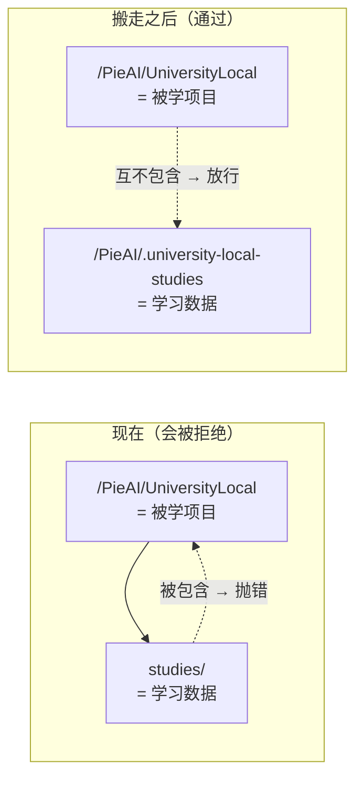

# 自学本项目研究

**交付状态（2026-08-06）：** 本文部分方案（「把 studies 搬出仓」）**未被采用**。
落地的是仓外 airlock 钉钉副本 + `university-local` study；见
`docs/reference/what-lives-where.md` 与 current-work Self-Study 收据。守卫
`assertSeparatedRoots` 仍然有效，不要削弱它。

把 UniversityLocal 自己加进它的学习项目列表里，会不会出现递归、会不会出问题。
你记得「以前加过，好像出问题了」——你的记忆是对的，本文查出了确切原因。

## 一、结论：不是递归，是一行守卫

**它不会无限递归。它会在第一步就被明确拒绝。**

拦路石在这里：

```text
server/config/load-config.ts:124   assertSeparatedRoots()
server/studies/repository.ts:176   registerLocalGitSource() 调用它
```

这个函数做一件事：检查「学习数据目录」和「被学项目目录」是不是互相包含。是的话，
抛出

> studiesRoot and sourceRoot must be separate and must not contain each other

而默认的学习数据目录就在项目里（`university-local.config.json` 写着
`"studiesRoot": "./studies"`）。所以：



学 SupaLuv、学 TuringPact 都没事，因为它们在项目外面。**只有学自己会踩到。**

## 二、这个守卫是对的，不要去改它

有个诱人的「捷径」：给守卫加一个例外，「如果被学项目就是 UniversityLocal 自己，
就放行」。**别这么做。**

它守的是一条真实的数据边界。打个比方：这条规则相当于「病历柜不能放在病房里」。
理由不是迷信，是一旦放进去，查房时（做快照、跑分析）就会连病历一起扫进去——而
病历里有你的复习记录、答题记录、个人进度，那是这个系统里最私密的东西。

具体到代码：UA 分析时会用 `git worktree add` 在
`studies/<study>/ua/<analysisId>/workspace` 检出一整份被学项目
（`server/ua/adapter.ts:299`）。如果被学项目就是 UniversityLocal，而学习数据又在
UniversityLocal 里面，那这份检出就**套在自己的学习数据旁边**。今天恰好安全（见
第六节），但那是靠 `.gitignore` 这个巧合守着的，不是靠设计。守卫存在的意义就是
不让安全依赖巧合。

**你已经选了正确的解法：把数据搬出去。**

## 三、干净解法：把 studies/ 搬到项目外

好消息：**这条路代码里早就修好了，一行不用改。**

- `initializeExternalStudiesRoot()`（`server/config/load-config.ts:99`）
- 脚本出口：`pnpm studies:init -- /绝对路径`（`scripts/init-studies-root.mjs`）
- 配置读取支持三个来源，优先级从高到低：环境变量
  `UNIVERSITY_LOCAL_STUDIES_ROOT` → `university-local.config.local.json` →
  `university-local.config.json`（`server/config/load-config.ts:144-151`）

外部目录必须带一个标记文件 `.university-local-root`，`studies:init` 会写它。
没有标记的外部目录会被拒绝，非空且无标记的目录也会被拒绝——这是防止你手滑把学习
数据倒进一个已经有别的东西的目录。

### 迁移前置条件（我已经在你机器上验证过当前状态）

| 条件 | 现状 | 为什么重要 |
| --- | --- | --- |
| 没有 `preparing` 状态的 UA 分析 | ✅ 当前 5 个分析：2 ready、1 failed、1 superseded、1 legacy-import | `preparing` 意味着可能有活的 git worktree，worktree 的路径是**绝对路径**存在 bare 仓库里，整体搬移会断链 |
| 没有活着的 UA workspace 目录 | ✅ 一个都没有 | 同上 |
| 没有注册中的 worktree | ✅ 两个 bare 仓库都只有自己 | 同上 |
| 本地服务已停 | 需要你保证 | SQLite 有 WAL 文件，运行中搬移可能损坏；而且 HTTP 服务按文件 inode 缓存学习库，路径变了必须重启 |

### 学习数据里存了绝对路径吗？我查过了

存了，但**没有一条是指向学习数据根目录的**，所以搬移不会断：

- `studies/*/source/registration.json` 里的 `sourceRoot` 指向**被学项目**
  （`/Users/yuanfei/PieAI/SupaLuv`、`/Users/yuanfei/PieAI/TuringPact`）。搬学习
  数据不影响它。
- `learner/backups/*.receipt.json` 里有历史备份路径。那是**回执**，只作记录用；
  `learner restore --from <路径>` 要你显式给路径，不读回执。
- `ua/*/data/knowledge-graph.json` 里有一处绝对路径，但它在**一个节点的中文摘要
  正文里**（描述某次任务时提到的路径），不是结构字段。我确认过代码里没有任何地方
  读 `projectPath` / `rootPath` 这类字段。
- 其余绝对路径全在 `ua/*/data/tmp`、`intermediate/tmp`、`.trash-*` 里，是 UA 的
  临时垃圾。

**特别重要的一点：`knowledge-graph.json` 必须一个字节都不能改。** 因为
`graphHash` 是对整个文件算的 sha256，证据校验会重新验它
（`server/content/evidence.ts:392-399`）。搬移只是改目录位置，不重写文件内容，
所以哈希仍然成立。**但这也意味着：不要试图去「修正」文件里那条过期的绝对路径。**
改一个字节，你现有的所有课程证据全部失效。

### 迁移步骤（研究结论，尚未执行）

1. 停掉本地服务。
2. 备份：`pnpm university learner backup --study supaluv`，turing-pact 同理。
   再对整个 `studies/` 做一次文件系统级复制。
3. `pnpm studies:init -- /Users/yuanfei/PieAI/.university-local-studies`
   （目录名待定，见待决问题）。
4. 把 `studies/supaluv` 和 `studies/turing-pact` 整体移过去。
5. 在 `university-local.config.local.json` 里写 `studiesRoot` 指向新位置。
   **用 local 配置而不是基础配置**，因为它是本机个人路径，不该进 Git。
6. 验证：`pnpm university status --study turing-pact` 能正常输出；打开 Web 界面，
   确认 15 门课程、今日学习、到期卡片都在；`pnpm verify` 通过。

## 四、顺带解决的第二个隐患

搬走之后还有一个白赚的好处：**UA 分析时那份「项目内部的项目副本」消失了。**

今天如果学自己，UA 会在 `studies/university-local/ua/<id>/workspace` 检出一整份
UniversityLocal。这个目录在分析期间（可能几小时）真实存在于你的项目里。它今天恰好
不会捅娄子——我逐个查了：

- `vitest.config.ts:5` 已经显式排除了 `studies/**`（说明这个坑以前有人踩过并修了）
- `tsconfig.app.json` 只 include `src`，`tsconfig.server.json` 只 include
  `server` 和 `src/domain`
- `oxlint` / `oxfmt` 都是路径限定的
- `studies/` 在根 `.gitignore` 里

但这是四道各自独立的防线**碰巧都覆盖到了**。任何一天有人加一个新工具、用默认的
「扫描整个项目」配置，它就会突然去分析那份副本。把数据搬出去，这个隐患从根上没了。

## 五、真正会出问题的地方（我逐条查证过）

### 真问题 A：**没有「新建 study」的命令**

CLI 支持的动词是：`status` `capture` `knowledge-list` `refresh *` `course *`
`focus *` `session *` `learner *`。**没有 `study create`，也没有
`study register-source`。**

现有的两个 study 是怎么来的？`scripts/bootstrap-supaluv.mjs` —— 一个把
`sourceRoot = "/Users/yuanfei/PieAI/SupaLuv"` **硬编码在第 20 行**的一次性脚本。
turing-pact 连脚本都没留下。

所以「加一个新 study」目前不是一条产品能力，是一次手工操作。这是自学本项目**必须
先补的缺口**，而且补它的收益不止于此——你以后想学任何第三个项目都需要它。

建议：抽一个 `study create --id <id> --title <标题> --source <路径>` 动词，
内部就是 `createStudy` + `registerLocalGitSource` + `createCleanSnapshot` +
开一次学习库（照抄 bootstrap 脚本的顺序，去掉硬编码）。

### 真问题 B：**脏工作区门禁，自学时几乎永远触发**

`prepareStudyRefresh`（`server/workflows/refresh-source.ts:148`）在被学仓库有未提交
改动时直接拒绝，除非显式加 `--acknowledge-dirty-excluded`。

学 SupaLuv 时这很合理——你不在改它。**学自己时，你几乎永远在改它。**

这不是 bug，规则本身是对的（只分析不可变的提交，绝不教未提交的代码）。但它意味着
一条必须写进操作手册的纪律：**自学的对象永远是「上一次提交」，不是你编辑器里的
那份。** 心理上要习惯这一点——你正在读的课，讲的是你昨天写的代码，不是你此刻正在
写的代码。

还有一个更细的坑：`assertSourceUnchanged` 会比对操作前后的工作区状态，包括未跟踪
文件清单。如果你的编辑器在长时间的 `refresh prepare` 期间自动保存了什么，它会
抛「Studied repository status changed during the refresh operation」。自学时建议
在干净的工作区做刷新。

### 真问题 C：**证据会不会天天过期？——分两种情况，差别很大**

这是我最担心的一条，查完之后可以放心一半。

`evaluateEvidenceFreshness`（`server/content/evidence.ts:347`）判定过期的规则是：

- **`fact` 证据**：比对**被引用文件本身**在两个提交之间的 blob 是否相同
  （`:363-367`）。你提交了一百次，只要没碰到被引用的那个文件，课程**不过期**。
- **`inference` 证据**：只要目标提交和证据提交不同，**即使文件一个字节没变，也标记
  为需要复审**（`:368-374`，原因是 "Inference requires review after the repository
  commit changes"）。

所以「我天天提交，课程天天过期」这个担忧，取决于你用哪种证据。好消息是现有语料
的比例是 **843 条 fact 对 5 条 inference**——项目实际上已经在压倒性地用 fact。

**给自学定一条规则就够了：自学本项目的课程优先用 `fact` 证据。** 需要下判断的
内容（「这个设计为什么这么做」）可以写在课文正文里，证据仍然指向真实代码行。

另外两条要知道的：

- **过期不会自己发生。** `refresh audit` 是一个你手动跑的命令，不跑就不会有课程
  变 stale。系统不会在你背后把课程标记失效。
- **审计需要目标提交上的 UA 分析。** 如果你想在新提交上做审计，而那个提交没有
  对应的 UA 分析，UA 绑定的证据会被报成「没有可比对的分析」而标记为等待
  （`:377-378`）。也就是说：**审计的真实成本是「再跑一次 UA」**，那是一次昂贵的
  AI 运行。所以自学的刷新节奏应该是「一批工作落地之后跑一次」，不是「每次提交
  跑一次」。

### 非问题 1：不会无限递归

我确认过：`git ls-files studies/` 是**空的**——`studies/` 下没有任何文件被 Git
跟踪（根 `.gitignore` 里有 `studies/`）。快照只包含提交里的内容，所以
UniversityLocal 的快照里**根本没有 `studies/` 这个目录**。

也就是说：项目的副本里没有学习数据，学习数据里的副本里也没有下一层副本。递归在
第一层就断了，而且是靠数据事实断的，不是靠特判。整个项目只有 176 个被跟踪文件，
其中 56 个 TS/TSX——UA 分析一次很便宜。

### 非问题 2：外部符号链接已经被处理

项目里有 13 个被跟踪的符号链接，其中 9 个指向项目外面
（`.agents/skills/` 下 7 个指向 PGS 的共享技能，`.pro-gov/agent-assets/` 下
2 个规则文件）。

这些在快照阶段会被 `isExternalSymlink`（`server/studies/snapshots.ts:82`）识别，
记进 `excludedPaths`，然后写进 `.understandignore` 并从 UA 工作区删除
（`server/ua/adapter.ts:226-265`）。**这个机制本来就是为这种情况设计的。**

内部链接（`CLAUDE.md -> AGENTS.md`、`.claude/skills -> ../.agents/skills`）会被
正确识别为内部，保留在分析里。

代价是：`comm-coach`、`impeccable` 这些共享技能的正文**不在**自学的分析范围里。
如果你想学它们，得单独把 PGS 注册成一个 study。

### 非问题 3：测试和构建工具不会扫到副本

见第四节。今天四道防线都覆盖到了；搬走之后这个问题彻底不存在。

### 一条注意事项：别引用 `course-proposals/`

`course-proposals/` 是**进 Git** 的（19 个文件）。它装的是课程提案 JSON。如果自学
课程的证据指向这些文件，你会得到一个镜厅：一节课引用的证据，是另一节课的生成材料。

技术上没有 bug，但学起来很晕，而且提案文件改动频繁，会平白制造大量过期。

**建议规则：自学课程的证据只指向 `src/` `server/` `scripts/` `docs/` `*.json`
配置文件，不指向 `course-proposals/`。**

## 六、学什么最有价值

这个项目值得学的东西，恰好是零基础课程学不到的一层——它们都是**只有真实项目才有
的东西**：

| 主题 | 证据在哪 | 为什么值得学 |
| --- | --- | --- |
| 为什么每条内容都必须挂证据 | `src/domain/schemas.ts` 的 `min(1)` 约束 | 这是「AI 生成内容如何可信」的一个真实答案 |
| 不可变快照与内容寻址 | `server/studies/snapshots.ts` | commit / tree / blob 到底是什么，在真代码里看 |
| 事件日志 vs 投影 | `sqlite-learning-store.ts` 的 `rebuildCardStateFromReviewEvents` | 「可以重建的状态」是架构里最重要的思想之一 |
| 状态机与生命周期 | `ContentStatus` + `course open-for-edit` 的来历 | 为什么「能不能改」要用状态而不是布尔值 |
| 结构检查为什么不够 | UA Content Gate Receipt + `server/ua/quality.ts` | 两次分析都通过了结构检查却都不能用——这一课极其真实 |
| 幂等与事务 | `#transaction` 可重入 SAVEPOINT 的那段 | 「重试安全」是所有和 AI 协作的系统的必修课 |
| 怎么跟 AI 沟通 | `.agents/skills/*/SKILL.md` + `docs/policy/` + `current-work.md` | 见 [沟通能力](opus-communication-coaching.md) |

`docs/reference/execution/current-work.md` 本身就是一份罕见的教材：它按时间记录了
每一次「以为做完了，结果发现真正的问题在别处」。那种叙述在教科书里买不到。

## 七、分阶段建议

**阶段 0**：迁移 `studies/` 到项目外，验证现有两个 study 完好，`pnpm verify` 通过。
不新增任何 study。这一步单独做、单独验证，因为它动的是你的个人数据。

**阶段 1**：补 `study create` CLI 动词（真问题 A），用它注册
`university-local`，做第一个快照。

**阶段 2**：跑一次 UA 全量分析（176 个文件，很便宜），审 quality gate。

**阶段 3**：先做一门小课（3–5 节），题材建议选「证据为什么是硬约束」——因为它同时
是自学的第一课，也是 [沟通能力](opus-communication-coaching.md) 那条路的证据来源。
跑通之后再扩。

## 八、风险

| 风险 | 严重度 | 缓解 |
| --- | --- | --- |
| 迁移时服务在跑，SQLite WAL 损坏 | 高 | 迁移前停服务 + 双重备份 |
| 迁移时有活的 UA worktree，绝对路径断链 | 高 | 迁移前确认无 `preparing` 分析（当前已确认无） |
| 有人「修正」`knowledge-graph.json` 里的过期路径 | 高 | 写进操作手册：这个文件按字节校验，一个字节都不能动 |
| 用 `inference` 证据导致课程频繁过期 | 中 | 自学课程优先用 `fact` |
| 为了省事去放松 `assertSeparatedRoots` | 高 | 明确记为禁止项 |
| 引用 `course-proposals/` 造成镜厅 | 低 | 写进课程生成简报的禁止清单 |
| 自学课程讲的是「上一次提交」，和你手上的代码不一致 | 中 | 接受它，并写进操作纪律 |

## 九、待决问题

1. **外部学习数据根目录放哪、叫什么？** 建议 `/Users/yuanfei/PieAI/.university-local-studies`
   ——和被学项目同级，不在任何一个仓库里，一眼看得出归属。需要你确认。
2. **`study create` 动词的确切形状？** 要不要一次性完成「建 study + 注册源 + 首个
   快照」，还是分三个动词？倾向：一个动词做完，因为三步之间没有有意义的中间态。
3. **自学 study 的 id 叫什么？** `university-local` 最直白。
4. **要不要把 PGS 也注册成 study？** 那样共享技能的正文就能被学到。不是现在要做的
   事，但会影响第 1 题的目录布局。
5. **UA 分析的刷新节奏？** 建议「一批工作落地后」而不是「每次提交」，但具体触发点
   需要你定（比如每次 `current-work.md` 新增一段 Receipt 时）。
