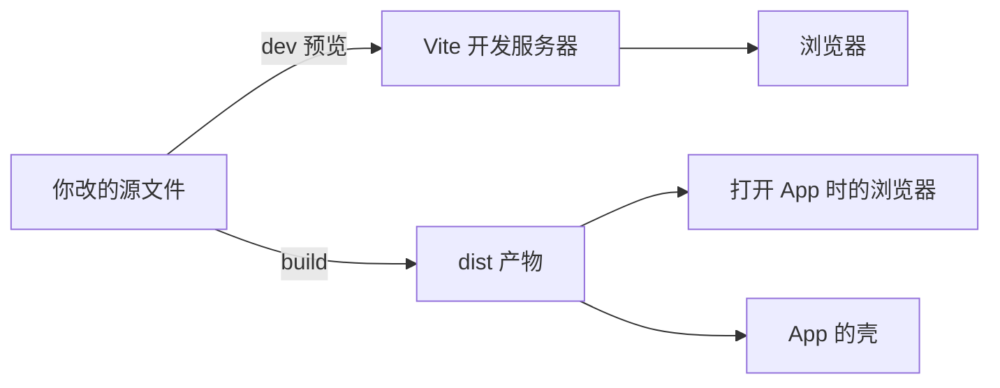

# 用户看到的 App，和开发者改的文件怎么连起来？

## 你点开的界面，和做的人改的文件，对得上吗？

你点开图灵密约，看到一整套能直接点的界面。

开发者改产品时，编辑器里往往是另一批文件：名字、位置和你设备上看到的东西对不太上。

那些给人改的文本文件叫源码，也叫源文件。它还不是你手机上能点的图标。

:::detail[什么叫「源码」？]
源码就是开发者每天在改的那些文本文件。打开项目时你会看见一堆带 `.ts`、`.tsx`、`.css` 后缀的文件，那些多半就是源码：写给开发人员读和改的，不是直接给手机运行的。你看到的界面，是这些文件被读取、整理后长出来的；源文件本身并不是那个图标。

**打个比方：**源码像菜谱，写清了要做什么、怎么做；你点开的界面是按菜谱做出来的菜，不是菜谱本身。
:::

做软件时，电脑常常还要做一道加工：读入源文件，检查、整理，再写出一份给设备直接打开的成品。这道工序叫构建。成品会另放进一个输出文件夹，不会覆盖你正在改的那一份。

:::detail[什么叫「构建」？]
构建就是那道加工步骤：电脑读入你改好的源文件，检查、整理、打包，写出一份给浏览器或 App 直接打开的成品。原文件还在，多出来的是整理后的成品。没有这一步，用户设备往往读不懂你编辑器里的原始文件格式和路径：那些后缀、那些文件夹分法，是给开发者用的，不是给手机直接打开的。
:::

:::detail[加工后的成品为什么要另放一个文件夹？]
因为源文件要留着继续改，成品要给设备打开。两份如果混在同一个地方，下次保存源文件时，很容易把整理好的成品盖乱，或者把没加工好的草稿直接交给用户。所以构建把成品写到约定的输出文件夹里；你日常改字，改的依然是源文件。
:::

这份成品可以用浏览器打开，也能交给装网页的应用外层去打开。这个外层叫壳：不是手机保护套，而是把网页装进 App、让你能点图标打开的那一层。同一项目里还有命令清单、构建配置和壳取网页的配置；对着这些名字读，才能知道路怎么走。

## 先猜一下

你只改了源文件，还没跑构建——已经交给壳或浏览器的那份成品，会不会自己变成你刚改的样子？为什么？

先写下你的判断，再往下看答案。

## 答案

不会自己变。已经交给壳或浏览器的那份成品，是上次构建写出去的，并不是你手头正在改的源文件。

## 从用户打开的界面，一站一站往回查

从你看到的界面往回拆，走三站。初看配置像术语清单，每站只盯一个文件夹名或短命令。

### 第 1 站：壳去哪里拿网页？

壳通常不自己重画一套界面。配置里写着：去某个文件夹取已经写好的网页成品。

[[evidence:capacitor.config.ts:11]]

这一站只盯目录名：壳认的是 `dist`。`webDir` 的字面意思是「网页目录」——告诉壳去哪里找那包网页。

:::detail[壳去文件夹里拿的是什么？]
拿的是已经整理好的网页成品，不是你正在编辑的源文件。壳把网页装进 App 给你打开；它自己通常不重画按钮和文字，而是按配置去指定文件夹取页面。
:::

### 第 2 站：谁把东西写进 `dist`？

网页是谁写进 `dist` 的？看这个项目的网页打包工具 Vite。

:::detail[Vite 是干什么的？]
Vite 是这个项目用来开发和打包网页的工具。开发时你改完，它负责尽快让浏览器看到变化；正式打包时，它负责把源文件整理成网页成品，写进输出目录。你现在不必先会用它。
:::

[[evidence:vite.config.ts:42-44]]

初看会绕。这段先写了 `build: {`，表示下面是打包相关的设置。认准其中的 `outDir: 'dist'`，字面意思就是「输出目录」。夹在中间那行管的是打包后文件会不会太大，不决定写到哪个文件夹。构建跑完后，网页成品落在 `dist`——和上一站壳去取的名字对齐。

### 第 3 站：你平常敲的命令从哪来？

项目里有一份常用命令清单，文件名叫 `package.json`。下面两行是清单里登记的两个短名字。你在电脑里敲短名字，电脑就去跑后面那串命令。

[[evidence:package.json:8-9]]

:::detail[`package.json` 里的短名字是怎么用的？]
这份清单会给常用操作起短名字。短名字写在清单里专门放命令的那一栏；你现在看到的是栏里的两个名字，以及它们各自对应的命令。不必一次记全；先认两个：`dev` 和 `build`。

**打个比方：**短名字像门牌，门牌后面才是真正要走的那条路。
:::

开发者常把这些短名字叫做脚本。

- **dev**：开发模式。这里的值是 `vite`——启动即时预览：你改完代码，浏览器里常常很快能看到变化，不必先等正式打包。
- **build**：正式打包。先做一次检查，再让 Vite 把前端成品写出去。你打开 App 时长期看到的，是这类构建之后的结果，而不是编辑器里未加工的源文件本身。

日常改界面，改的是源文件，别直接改 `dist` 里的文件。你下次再构建，那些文件会被重新生成，手改的痕迹会被盖掉。

三站合在一起，打开 App 时走的是：

**源文件 → `build` 写出 → `dist` → 浏览器或壳打开。**

开发时也可走另一条：`dev` 读源文件，尽快在浏览器里给你看，通常并不先写入 `dist`。

:::detail[开发预览和正式打包，走的是同一条路吗？]
不是同一条。`dev` 是给开发时看的即时预览：工具读源文件，尽快在浏览器里给你看，通常不把成品写进 `dist`。`build` 才把东西写进 `dist`，再交给你打开 App 时用的浏览器或壳。

:::

## 再想想

上一课已经把打开方式和产品内容分开：壳只是去某个目录取成品。现在这条线补上了中间那一截——成品是构建写出来的。你先把网页这条「源文件 → 构建 → `dist`」走通，比急着钻进某个壳的打包细节更划算。

[[lesson:same-product-many-shells|同一个产品，为什么能在网页和手机 App 里打开？]]

## 自检

**问：** 日常改界面时，你通常是直接改 `dist` 里的文件吗？

**问：** 要把项目正式打包，`package.json` 里对应的脚本短名字是什么？

## 一句话

**图标背后是成品；成品背后是源文件与构建工具。**
