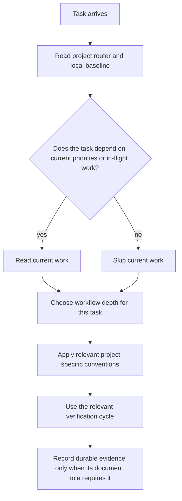

# Engineering Runtime Agents Routing v1.1

Shared routing algorithm for app, game, runtime, and code-heavy projects.

This file decides **how to choose a workflow**, not what the project is currently building. Current work belongs in the project's `docs/reference/execution/current-work.md` or equivalent.

## Core Flow

`current-work` is a conditional state surface, not universal startup context.
Likewise, AI-in-the-Loop applies when implementation or runtime verification
needs it; a documentation-only or read-only routing task does not load that
policy by default.

## Keep It Small

Use this router only to pick depth and workflow. Do not use it as a project roadmap.

## Three-Stage Delivery

<!-- PGS-DELIVERY:THREE-STAGE -->

1. **Edit locally.** Run relevant local checks with isolated data and mocks; do
   not start paid external validation during ordinary development.
2. **Verify, then push.** Pass the checks appropriate to the changed surface
   before pushing. Ordinary push/PR saves code; it must not start hosted Actions
   or Vercel preview/production deployments.
3. **Release explicitly.** A release request may continue through cloud acceptance
   and publication within the agreed budget. Check credentials, environment and
   candidate readiness first; failed or missing required evidence blocks release.
   Publish only the tested source/artifact. Reuse results only while source,
   dependencies, relevant environment and retained artifacts remain valid.

An explicitly requested preview/staging acceptance belongs to stage 3. An edit
or push request stops at stage 2. Do not relabel routine saves as release requests.
Repeated failures require a smaller reproducer, logs and a relevant fix or new
evidence before rerunning; do not loop whole suites or silently raise budgets.
Keep existing release/security gates and production runtime monitoring. These
rules govern engineering validation, not separately authorized creative production.

Reuse existing project commands; do not add a CI service, hook or profile.

## Project-Specific Conventions

Use existing commands and actual project constraints in `AGENTS.md` or
`docs/policy/best-practice-for-this-project.md`. A project may document special
lanes, but common task categories do not require a separate lane profile.

Planning, research and testing should match the change's risk. Use relevant
checks and required delivery gates; expand or repeat only for related changes,
failures or unresolved questions. Routine work does not require new Spec, Plan,
ADR or proof documents. Keep durable decisions and handoff evidence in their
existing document roles.

## Host Compatibility Boundary

Follow the Project AI Host SSOT in `docs/governance/ssot-v1.1.md`. Host-specific
runtime settings must not create a second project router or skill tree.
