# University：少一点解释，多一点想学的感觉

**这份文档先展示最近追加的操作优化，再保留上一轮页面精简对照。常驻开发告示没有加回来；答案防丢、课程搜索、三态判题、隐私和付款保护都保留。**

这次没有重画地图，也没有改写课程。主要改变的是：先看到价值和下一步，细则需要时再打开；完成一件事，用短反馈回应，不接一段说教。

图片均来自 `University-product` 工作树的实际浏览器页面，不是概念图。成对画面使用相同地址、390×844 手机模拟尺寸、浅色主题；没有真实账号、真实付款或用户私人答案。原图与过程收据保留在 [本轮证据](../product-review-evidence/lightness/)。

## 最新自查｜不只是首页变短，开始以后也要顺

**位置：练习 → 练 3 题。** 用同一浏览器、同一批实际题目、同样的手机尺寸，从开始一直点到结束。检查使用独立访客和可重复的抽题顺序，没有填入个人记录，也没有用脚本修改分数。

**改前：** 开始以后，标题、介绍、统计入口还留在题目上方；电脑上又把题目挤在半栏。看起来首页已经简洁，真开始做题，仍要往下找按钮。

**改后：** 准备页只在开始前出现。进入练习后，屏幕主要留给题目、答题进度和“先停一下”；提交按钮加宽。没有缩小字号、截断选项或把题目做成图片。

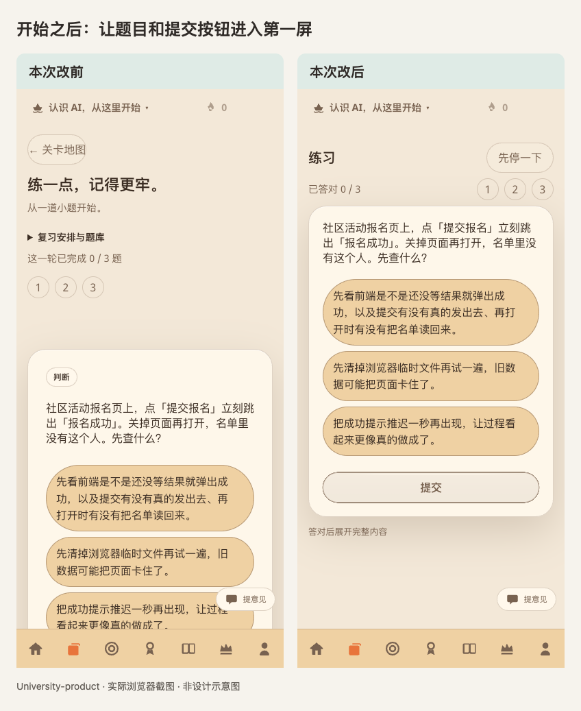

**同一道题、390×844 手机布局的测量：** 题目开头从距屏幕顶部约 454 像素移到 191 像素；提交按钮底部从约 895 像素移到 603 像素，按钮宽度从约 66 像素增至 316 像素，高度仍为 44 像素。也就是这道题不必先滚动，才能找到提交。长题仍可正常滚动，不承诺所有题目都塞进一屏。

### 最后一题，不再抢走解释

**改前：** 第三题一答对，就自动变成庆祝页，刚刚这题的解释随之消失。

**改后：** 先看到真实的答案解释，需要深入时可点“看完整词条”；读完后点“完成这一轮”，才进入庆祝。答对记录在提交时已经保存，不因为多点一次结束重复计分。

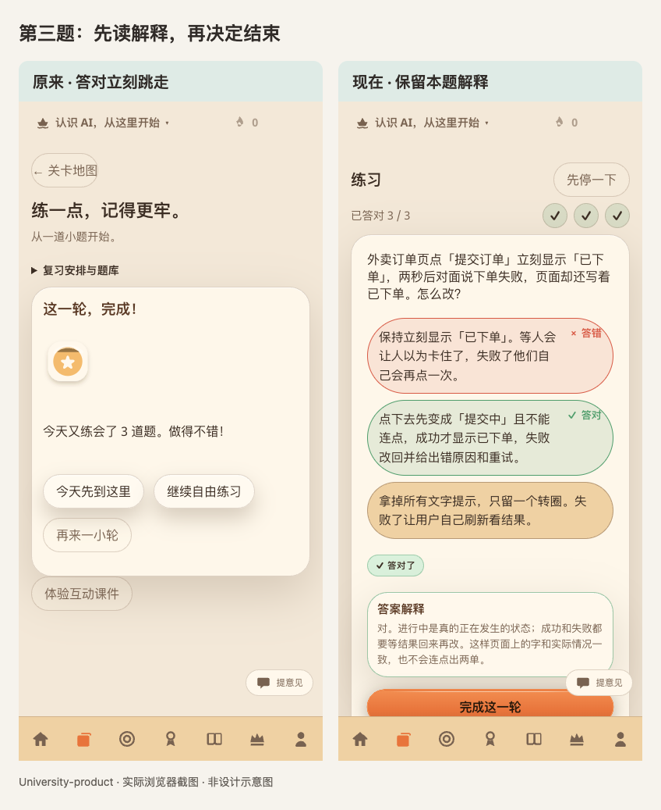

换到下一题时，视图与键盘焦点一起回到当前标题，不会停在上一题靠下的位置。打开过的词条在下一题默认收起，避免整篇内容突然挤进屏幕。

### 结束动作更清楚，自查还补掉一个视觉问题

结束页不再重复准备区，“今天先到这里”成为主要按钮；继续自由练习和再练一轮仍然保留。短庆祝仍来自真实完成，减少动效时静止。

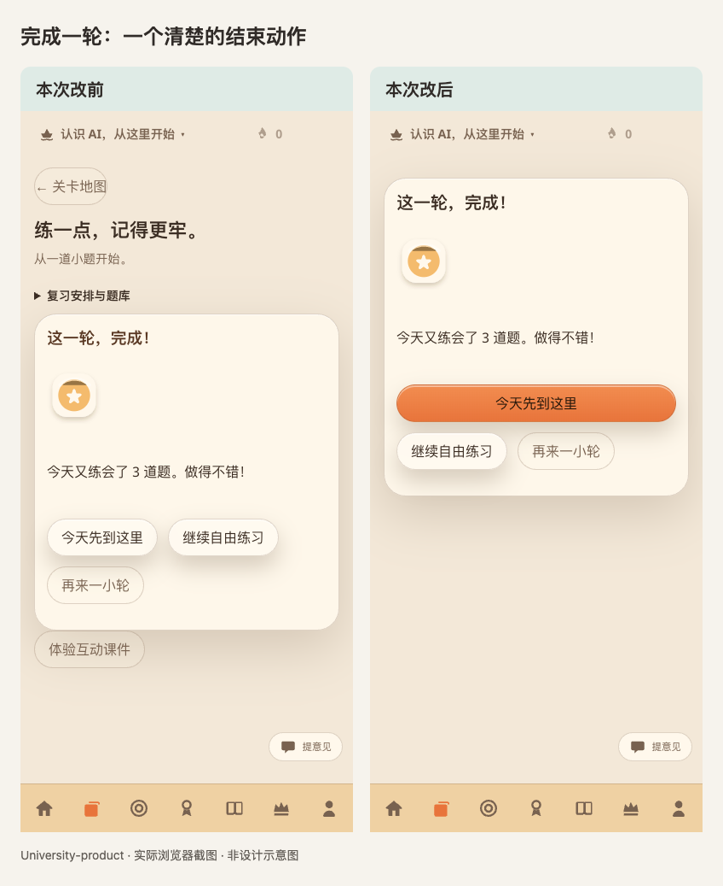

**看图才发现的遗漏：** 未选答案时，“提交”的半透明文字和深色按钮底混在一起，像一根没字的条。现在未选答案用清楚的浅底文字，仍然不可提交；选择答案后才恢复橙色主按钮。浅色与深色都经过检查。

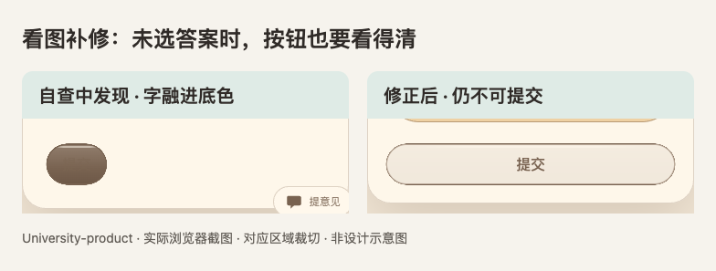

本轮还发现“看完整词条”可能被底部固定导航挡住，已经给答题页面留出足够的滚动空间，并用实际点击检查。已有的详情入口点击面积本来达标，保留原样，没有为制造变化另做一套控件。

**判断：这次的提升主要在可操作性和学习连续性，不只是字变少。** 上面的改善有同条件画面和操作记录支持；没有据此宣称留存率、学习成绩或转化率提高。手机是浏览器模拟尺寸，尚不是实体手机验收。当前检查结果与未完的整产品整合事项，统一见 [实施计划](../../../plans/active/product-completeness.md)；原始截图见 [本轮操作证据](../product-review-evidence/focus/)。

## 01｜会员：先让人看到值得升级的理由

**上一版：** 常驻“会员尚未开售”，还把年付、钱包、未开放功能等解释集中摆在主页面；手机上先看到免费卡，付费价值和动作靠后。

**现在：** 一句“学到哪，换台设备接着学”，三条核心权益，完整价格和“升级会员”。会员卡优先，免费课程仍然可见。年付总额、美元计价和“AI 批改按次另计”保留在选择附近，不藏起来。

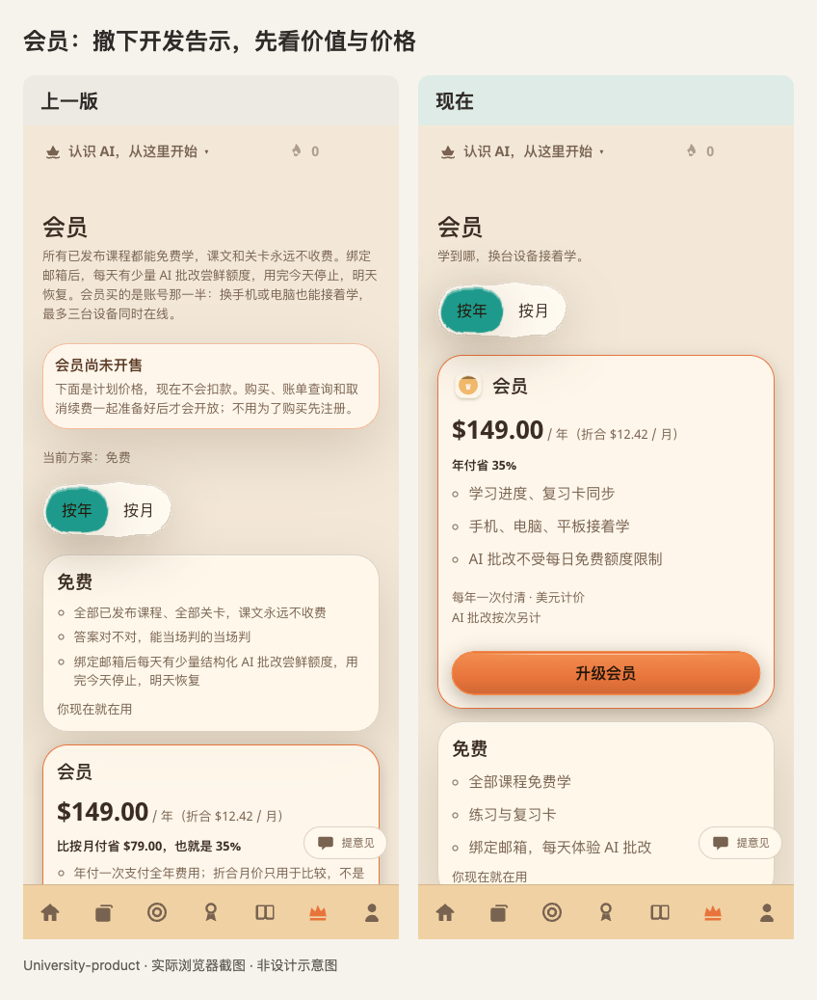

不是把“不能付款”伪装成“付款成功”：只有实际点购买、服务暂时不可用时，才显示一句“本次未扣款，请稍后重试”。已经是会员的账号显示会员状态和管理入口，不再被催着重复升级。

## 02｜欢迎：一句主张，一个清楚的开始

**上一版：** 品牌主张之外，还有邀请段落、学习方法、课程说明和重复的免费说明。

**现在：** 保留品牌主张、真实第一课和“开始学习”。“看明白 → 动手试 → 记得住”用三个小图标和短词传达。换方向、直接选课、已有账号登录仍可用，但不和开始按钮抢注意力。

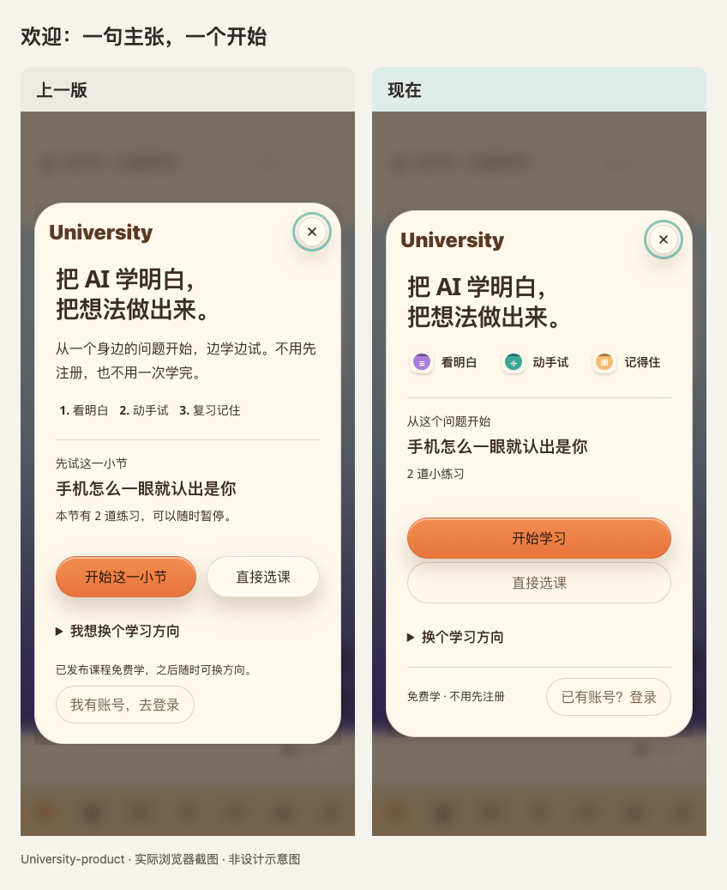

三个小图标依次进入，按钮从一开始就能点。回来学习和课程分享链接不必再经过欢迎页。

## 03｜回答问题：一条反馈就够了

**上一版：** “无法判断”同时出现两块说明，下面还接模型信息、提示和 AI 选项。

**现在：** 只先显示一条“还不能判断”，旁边有“看提示”。需要 AI 帮忙再展开相应入口，费用和确认动作仍在里面。答对时用一个小勾回应。

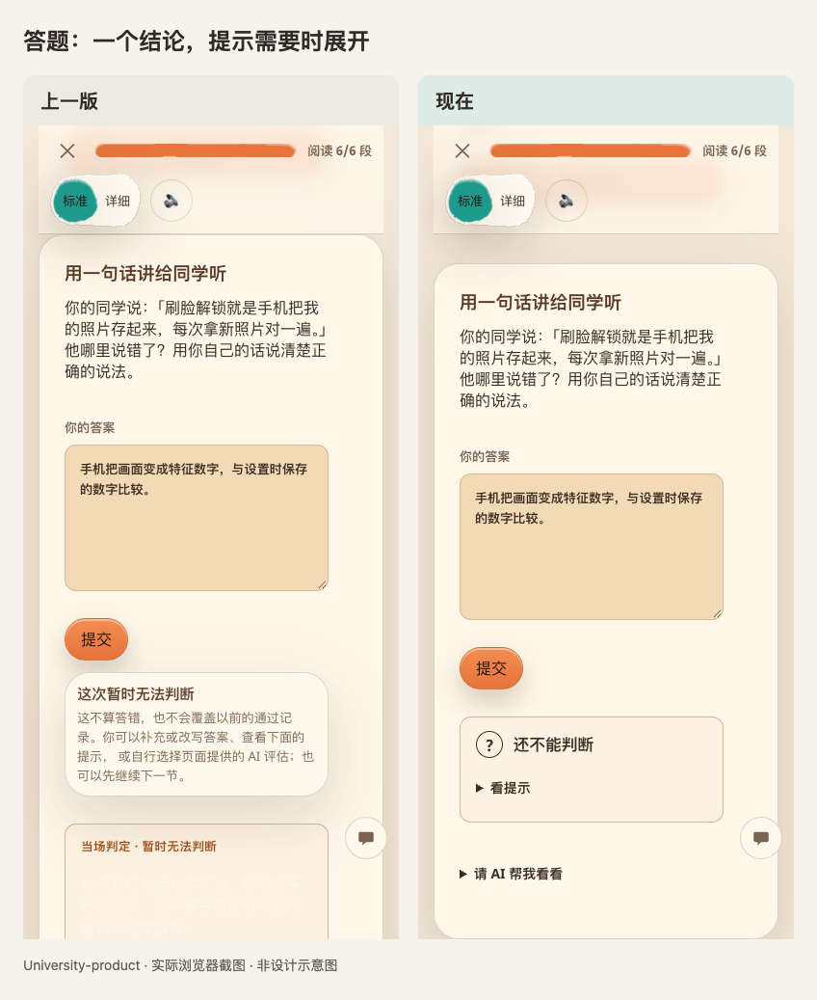

“系统还不能判断”仍然不算答错，也不自动通关。正在写的文字仍会保存；正常提示缩成“草稿已存本机”，保存失败则保持明显提醒。

## 04｜练习：打开后就知道怎么开始

**上一版：** 先读到期安排、题库总量、分类数字和解释，再找到练习入口。

**现在：** 先看到“练 3 题”和“自由练习”。题库与复习安排收进有名字的入口；今天真的有到期卡时，复习动作仍会出现。互动课件入口保留在次要位置。

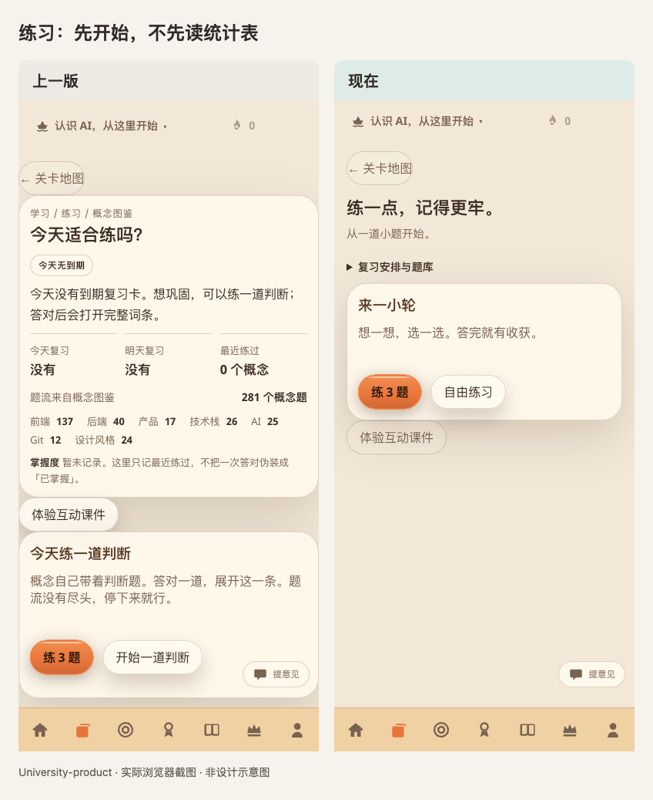

走查还修正了一个随删字暴露的问题：短页面原先会把顶部状态栏拉得很高，现在状态栏和开始按钮都回到正常位置。不是靠把文字换成大片空白来假装简洁。

## 05｜任务：保留行动，收起规则

**上一版：** 每张任务卡同时有标题、数字、进度条和解释，很多是在重复表达同一个状态。

**现在：** 保留要做什么、完成情况和直接开始的链接。单项任务不再重复画进度条；“任务怎么算？”点开再看。没有到期复习不会制造额外任务。

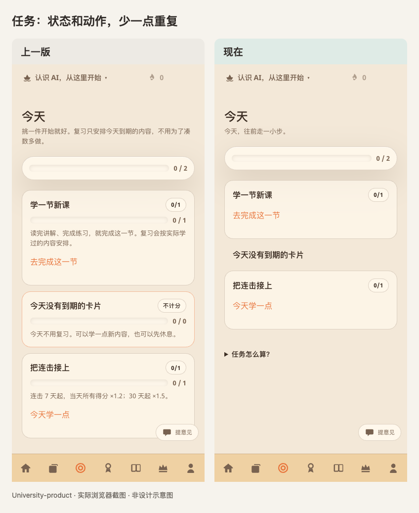

## 06｜成长：鼓励积累，不先上一课规则

**上一版：** 一打开就要理解完整阶梯、记忆间隔和“并不是真人排行榜”的解释。

**现在：** 先看到自己的阶段、本周学习和实际进度；完整阶梯放进“成长规则”，并给出“去巩固一下”的下一步。

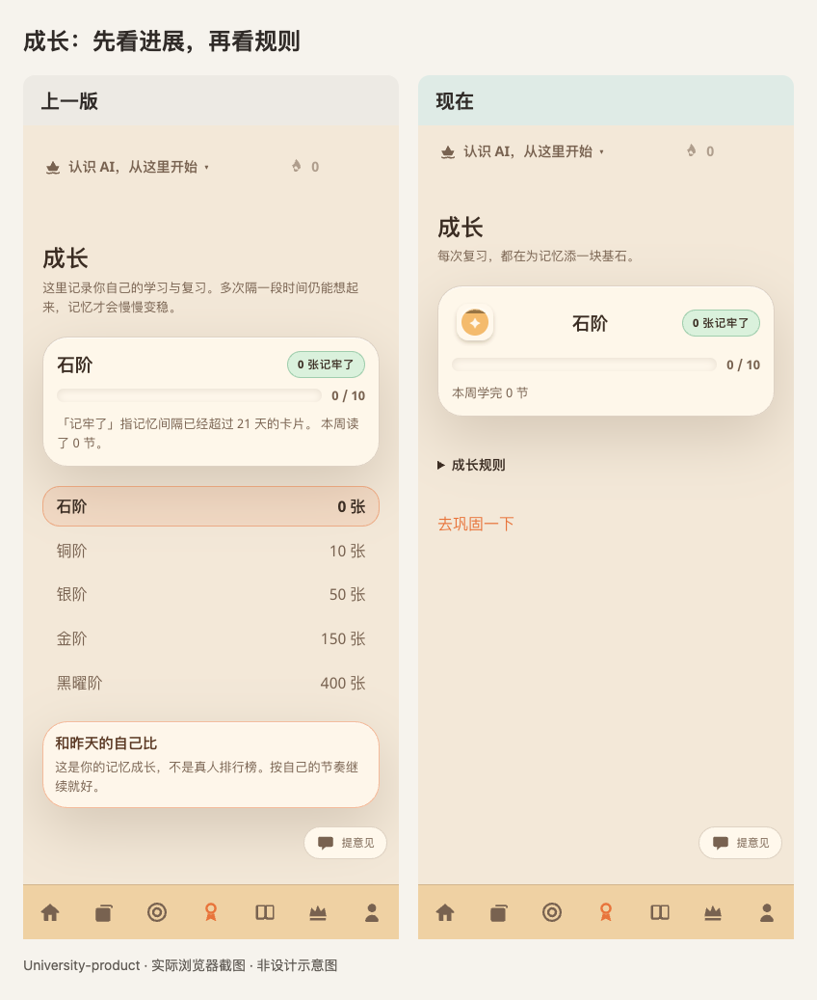

数据没有编造，也没有新增虚假的对手。

## 07｜个人档案：正常状态轻一点

**上一版：** 头像下有大段本机保存、云端未配置与跨设备说明。

**现在：** 正常状态只显示“已存本机”或“已同步”，点击能查看详情。账号区域用简短邀请和登录入口；已登录时主要显示身份与退出动作。登录表单需要时展开，不长期占满档案页。

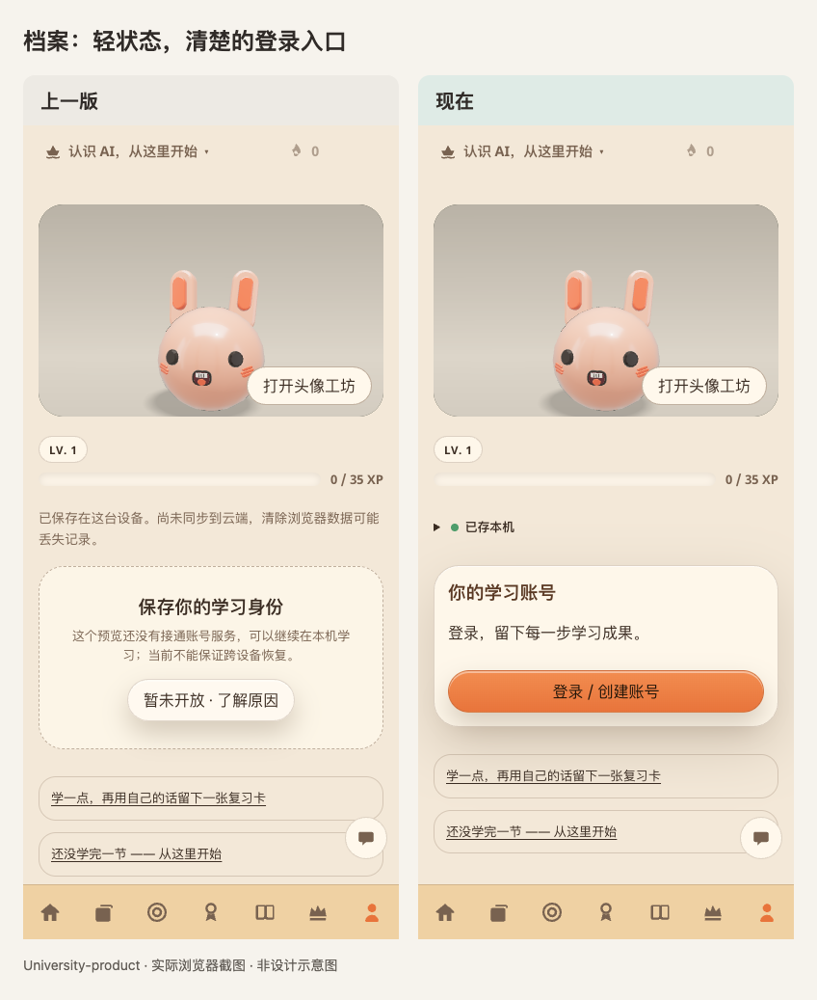

这里的“简洁”没有删除失败提醒：新变化没保存时，仍会提醒先别关闭页面，并提供重试。

## 08｜设置：开关在前，解释在后

**上一版：** 外观、语音、隐私和提醒各有一段甚至几段说明。

**现在：** 先给开关和当前状态；语音隐私、提醒设置、阅读辅助都能按需打开。“谁能看到？”会区分好友能看到的课程，与小组成员能看到的小节、光标。

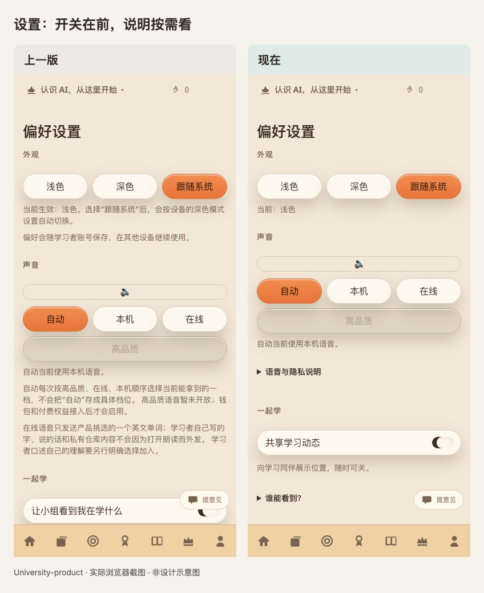

共享默认仍然关闭。没有因为精简文字就自动申请通知权限或把用户的学习活动分享出去。

## 09｜三题结束：用短庆祝回应认真完成

**上一版：** 完成后主要是一段“练了几个概念，但不代表记牢”的说明。

**现在：** 真实完成三道题后出现“这一轮，完成！”，配一个短暂的奖杯动作；可以今天到这里，也能再练。过程中三个小圆点随实际完成变成勾，不靠多点几次按钮假装完成。

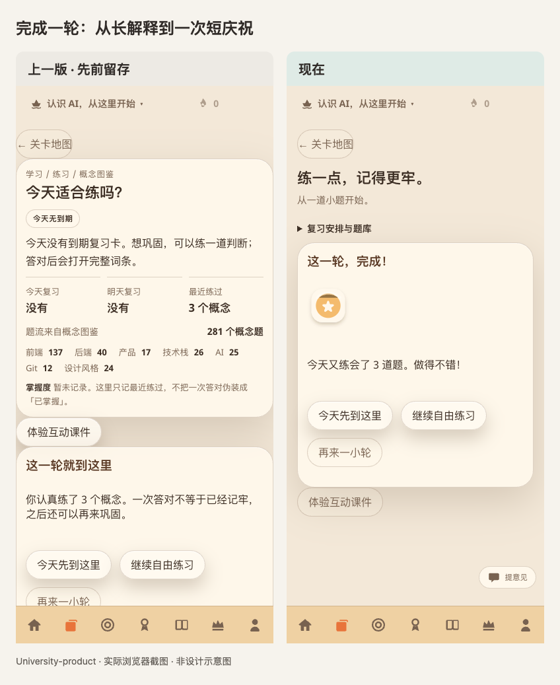

本轮增加的动效都只播放一次：欢迎步骤、小勾、练习结束奖杯。系统选择减少动态效果时不播放装饰动画；静态截图不代表动画录像，实际效果在本机产品预览中查看。

下面这张动图来自实际完成三题后的页面：把页面原有的 650 毫秒 CSS 动画按时间定格采样，再合成一次播放的 GIF，不是另外画的设计稿。单独打开图片、刷新可以重播。

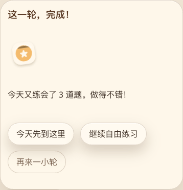

## 细则没有消失，只是不再堵在前面

下面是现在**点开之后**的真实界面。入口有明确名字，手机可以点，键盘也能展开和关闭，不依赖鼠标悬停。

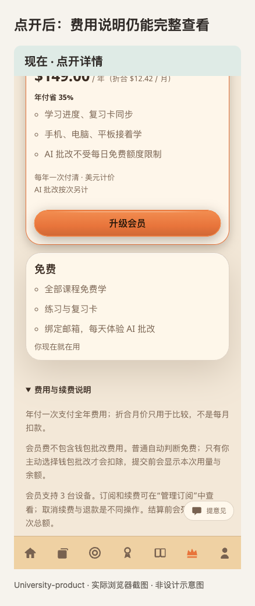

完整价格、计费周期、额外收费事实和实际失败仍出现在做决定的位置。其余说明移到需要它的时刻，并不是删除服务规则。

## 这五轮怎么走的

这次也量了文字，而不是只凭感觉说“变简洁了”。以下是同一手机尺寸下，主内容区域**默认显示的字符数，去除空白，不含折叠详情**；不是阅读时间、转化率或用户实验结果。

| 页面 | 上一版 | 现在 | 默认显示文字减少 |
| --- | --- | --- | --- |
| 欢迎 | 130 | 76 | 42% |
| 会员 | 455 | 153 | 66% |
| 练习 | 216 | 61 | 72% |
| 任务 | 163 | 57 | 65% |
| 成长 | 139 | 44 | 68% |
| 设置 | 547 | 116 | 79% |

数字来自本轮证据目录中的 `before/receipt.json` 与 `final/receipt.json`。缩短的说明仍能按需打开；保留的学习功能没有因这张表而删除。

| 轮次 | 实际完成的工作 |
| --- | --- |
| 第一轮 | 会员和欢迎：撤下开发告示，减少重复介绍，优先显示价值与主按钮；拍摄第一版检查 |
| 第二轮 | 答题、练习、任务与成长：合并反馈、收起统计和规则；再拍页面，发现短页面被空白撑开的布局问题 |
| 第三轮 | 账号、保存和设置：正常状态缩短、详情按需展开，同时修正短页面布局 |
| 第四轮 | 小屏、深色、键盘和动效反查；补齐当前会员不重复升级、隐私可见范围与真正的减少动态效果检查 |
| 第五轮 | 旧功能与新界面一起回归，重新构建、拍照、比较文字量，整理本页与历史证据 |

这里只描述本轮界面修订。最新测试结果、课程格式整合和实际支付等发布事项，统一记录在 [实施计划](../../../plans/active/product-completeness.md)，不把本轮界面完成等同于已经发布或已经收款。

## 之前认可的功能，仍然在

答案防丢、三态判题、课程搜索、任务直达、三题练习、账号隔离都保留。[第一轮完整对照](first-pass-comparison.md) 保留原来的 12 组修改和原图；其中旧开发告示只代表当时版本，不是今天的产品设计。

本页为可渲染 Markdown，图片都使用相对路径。移动时把整个 `product-before-after` 文件夹一起带走。双击同目录 `index.html` 可直接阅读、点击图片放大。

## 设计依据

本轮参考 [多邻国核心页面设计复盘](https://blog.duolingo.com/core-tabs-redesign/) 的层级与留白、[Apple 的界面设计基础](https://developer.apple.com/videos/play/wwdc2025/359/) 的重点组织，以及 [W3C 的展开控件模式](https://www.w3.org/WAI/ARIA/apg/patterns/disclosure/) 和 [非必要交互动效指南](https://www.w3.org/WAI/WCAG22/Understanding/animation-from-interactions.html)。采用的是方法，不是复制别人的品牌；资料不能代替本项目的真实点击、截图和回归检查。
