# University：改之前、改之后，一页看明白

**第一轮历史记录，不是当前界面。** 用户随后要求撤下常驻开发告示、减少解释，并完成了轻量化修订。请先看 [当前改前改后对照](before-after.md)。本页中的“尚未开售”告示、长段保存说明和旧练习画面只保留当时的证据，不应据此恢复旧界面。

**这次主要动了：首次进入、答案防丢、判题反馈、找课、任务、练习、成长、个人档案、隐私和会员说明。地图没有重画，课程正文没有在这条产品工作线上重写。**

这里展示的是 `University-product` 工作树中已落地的改动，不是线上发布公告，也不是未来设计稿。改前图片来自原始检查，改后图片来自该工作树的实际浏览器页面。手机截图为 390×844 的浏览器模拟视口，不是实体手机验收。

每张对照图上都写了“改前／改后”；只有新增画面的，会单独标明“原来没有”。图片用相对路径保存在同目录的 `images/` 中，整份文件夹一起移动仍能看图。双击同目录 `index.html` 也能阅读并点图放大。

## 先找到你关心的页面

| 编号 | 在软件哪里找 | 这次加了、改了什么 |
| --- | --- | --- |
| 01 | 首次打开首页 | 新增可跳过的欢迎页，也能展开更换学习方向 |
| 02 | 课文末尾的答案框 | 没提交的文字，刷新后仍能找回来 |
| 03 | 提交答案后的反馈 | 把“暂时不能判断”和“答错”分开 |
| 04 | 课文最上面的进度条 | 裸数字改成“阅读 6/6 段”，不冒充全部学会 |
| 05 | 更多 → 目录 | 新增搜索；“正在学”改成推荐起点或下一步 |
| 06 | 任务 | 任务卡里可以直接开始，不必绕回首页找课 |
| 07 | 练习 | 新增三题一轮，做完有一个可以安心停下的页面 |
| 08 | 原来的排行榜入口 | 改为“成长”，明确是自己的学习记录 |
| 09 | 个人档案 | 改掉“第一节就有代码”的泛化承诺，新增实际保存状态 |
| 10 | 更多 → 设置 | 默认不共享学习活动；提醒未接通时说明原因 |
| 11 | 会员 | 先说明尚未开售，补充年付总额、额外费用与未开放服务 |
| 12 | 会员页的主按钮 | 不再让访客为了买一个尚未开售的服务先登录 |

## 01｜首次打开：原先直接看地图，现在先有欢迎页

**位置：** 首页。已经看过欢迎的浏览器不会反复弹出；用无痕窗口打开本工作树预览，可以看首次进入的效果。

**改前：** 没有独立欢迎页。用户一进来就看到地图、学习入口和一排功能，需要自己判断“这里是做什么的、我该从哪里开始”。原来的“开始学习”按钮确实存在，不是完全无路可走。

**改后：** 新增一张欢迎页，说明“把 AI 学明白，把想法做出来”，并直接列出要开始的真实小节。可以点“开始这一小节”，也可以“直接选课”、关闭欢迎或去登录。不强迫先注册，不让四页介绍挡住课程。

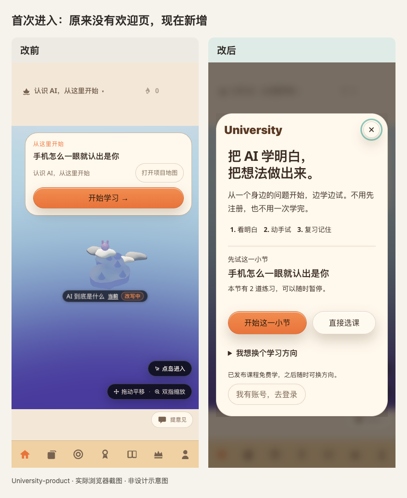

**新增在哪里：** 欢迎页下半部的“我想换个学习方向”原来没有。展开后可以换方向，第一课的推荐随之改变。原系统已有的课程系列切换仍然保留，不是这次才第一次能换课。

这次实际做的是文字和内容的短入场动效，不是先前提案里的“乘云入场＋四步小游戏”。静态截图不能展示动画；系统选择减少动效时，不播放这段入场效果。回访和课程分享链接也不必先过欢迎页。

## 02｜写到一半：原先刷新就没了，现在能恢复草稿

**位置：** 任意课文末尾的答案输入框。这里用同一节“手机怎么一眼就认出是你”演示。

**改前：** 输入了文字，但没点提交；刷新页面后，答案框变空。保存“已提交答案”并不等于保护了正在写的内容。

**改后：** 输入时保留本机草稿，刷新后能恢复。下面三格使用同一句检查文字：第一格是旧版刷新前，第二格是旧版刷新后，第三格是新版刷新后。不是用不同答案假装同一次测试。

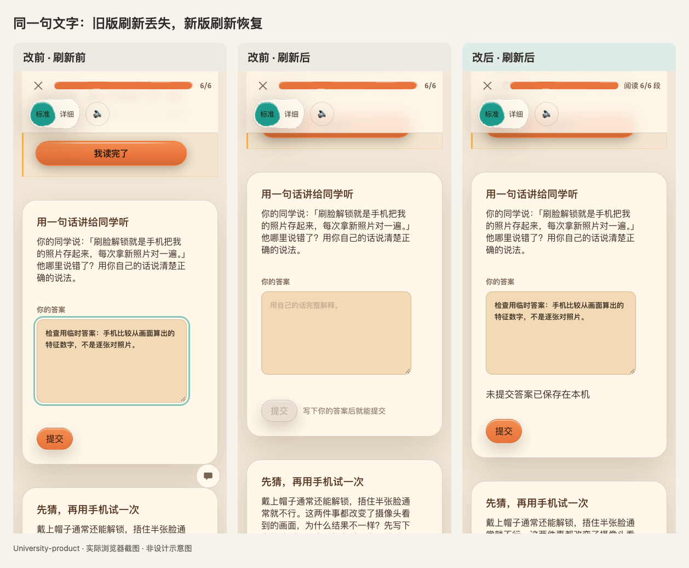

**注意：** 草稿保存在当前设备，并按账号、题目和课程版本区分；不等于草稿已经上传到云端。清除浏览器数据仍可能删除这些本机记录。

## 03｜交答案：原先把“判断不了”说成“未通过”，现在明确分开

**位置：** 课文末尾，提交自己的回答后。

**改前：** 检查中提交一段符合课文核心意思的改写，页面显示“当场判定 · 未通过”。实际上，免费规则只是不能可靠识别这段表达，却把这个限制说成了学习者答错。

**改后：** 显示“这次暂时无法判断”，并说明“不算答错”，可以补充答案、看提示、选择页面提供的 AI 评估，或者先继续阅读。它既不记成确定错误，也不自动算通关。

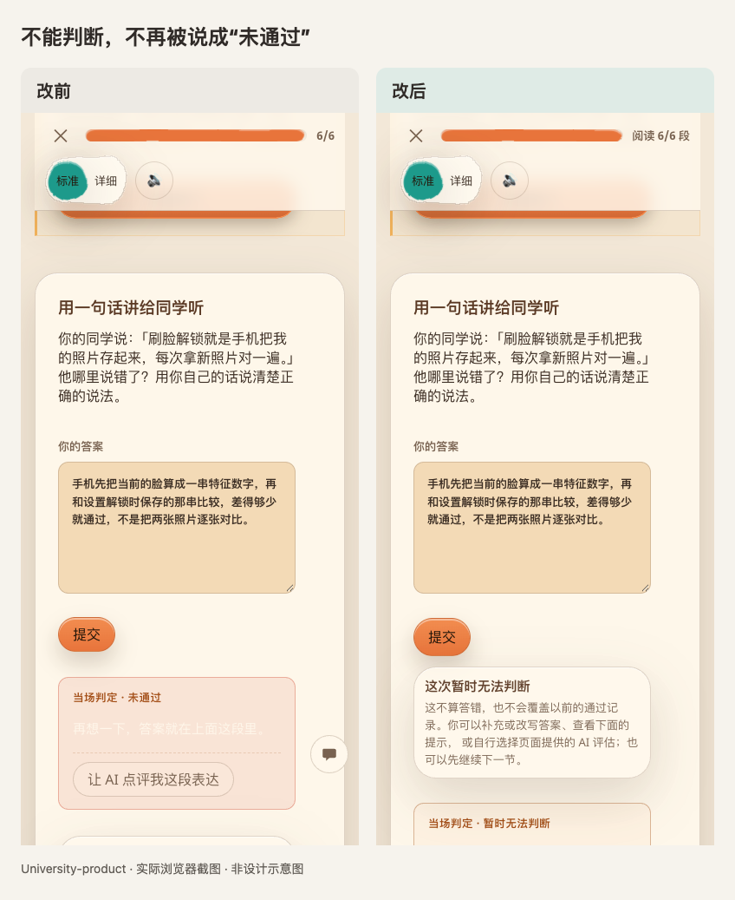

这不是“为了鼓励用户，什么都算对”。确定答对、确定答错、暂时无法判断，是三种不同结果。

## 04｜顶部数字：原先只有“6/6”，现在说清是在读哪一段

**位置：** 打开课文后，页面最上方的进度条。

**改前：** 只显示“6/6”，容易看不出这是阅读位置，还是练习完成数。

**改后：** 显示“阅读 6/6 段”。看到了最后一段，不代表题目都答对，也不等于这节课已经完成。

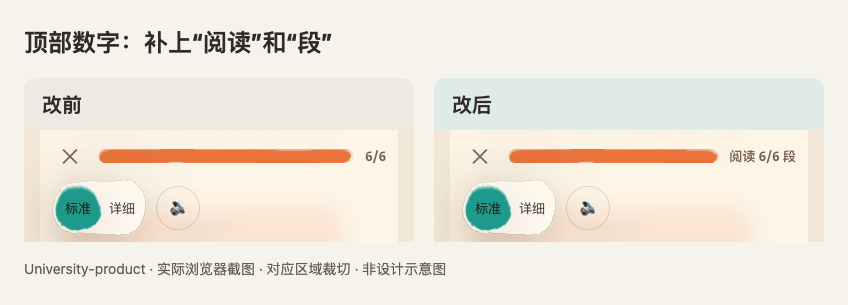

这张是同一位置的真实截图裁切，没有重画界面。

## 05｜找课：原先主要靠翻目录，现在能搜索，也不虚报“正在学”

**位置：** 更多 → 目录；本工作树页面路径为 `/catalog`。

**改前：** 目录靠逐层展开寻找，没有这一处搜索框。新访客还没开始，第一门课和第一节却会被标成“正在学”。

**改后：** 在目录上方新增“找一门课或一个问题”。没学过的起点改成“从这里开始”，推荐的小节显示“推荐下一步”；推荐不再冒充已经发生的学习记录。

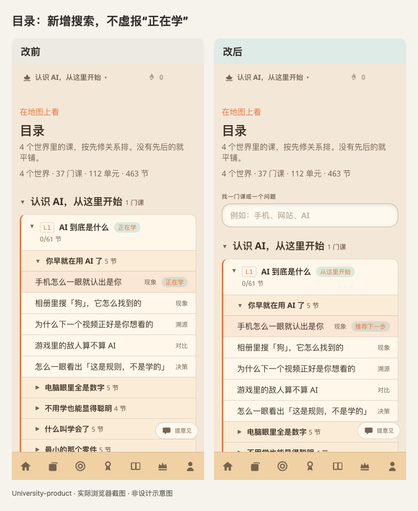

**原先没有、现在新增的内容：** 搜索结果会显示小节及其所属系列、课程、单元；点击结果就能进入实际课文。下图是输入“手机”后的真实结果，不是新写的课程。

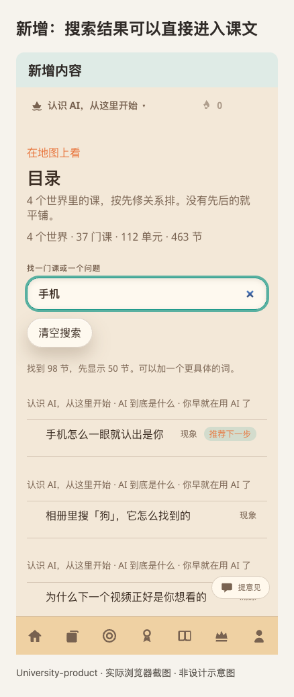

## 06｜任务：原先只告诉你做什么，现在卡片里就能开始

**位置：** 导航里的“任务”。

**改前：** “学一节新课”“把连击接上”只有说明和数字，卡片里没有直接去做的入口。说明里还会向用户讲“换任务是让人来开 App 的手段”，不像在帮助学习者。

**改后：** 卡片内新增“去完成这一节”“今天学一点”，直接带到对应学习内容。没有到期复习时，说清今天不用复习，不制造凑数任务；说明改成“挑一件开始就好”。

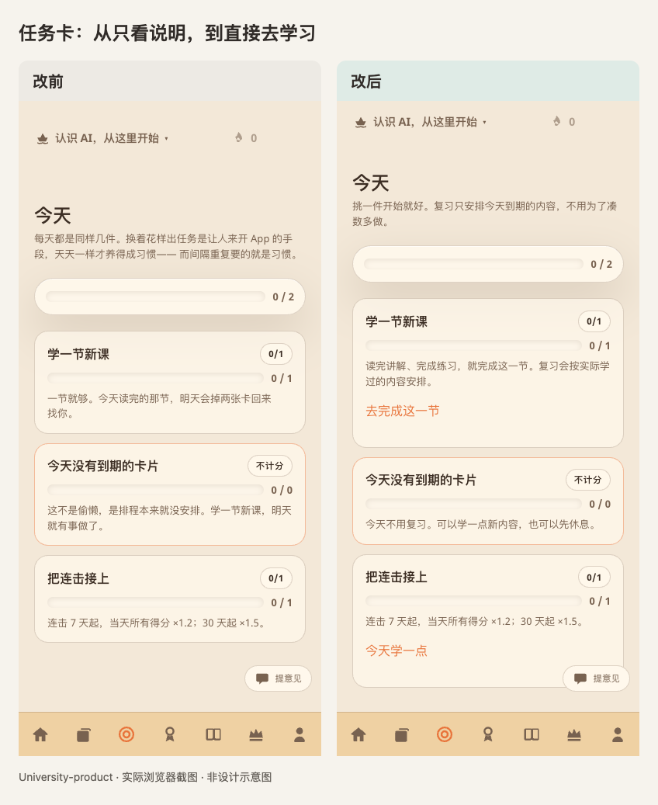

改的是任务到学习之间的路，不是凭空替用户增加进度。

## 07｜练习：原先题流没有尽头，现在可以选“三题一轮”

**位置：** 导航里的“练习”，进入判断题区域。

**改前：** 主要入口是“开始一道判断”，页面直接说明“题流没有尽头，停下来就行”。没有一个明确的短回合终点。

**改后：** 新增“练 3 题”，同时保留原来的自由练习入口。想少练一点的人有明确的小目标，想继续的人也没有被强制拦住。

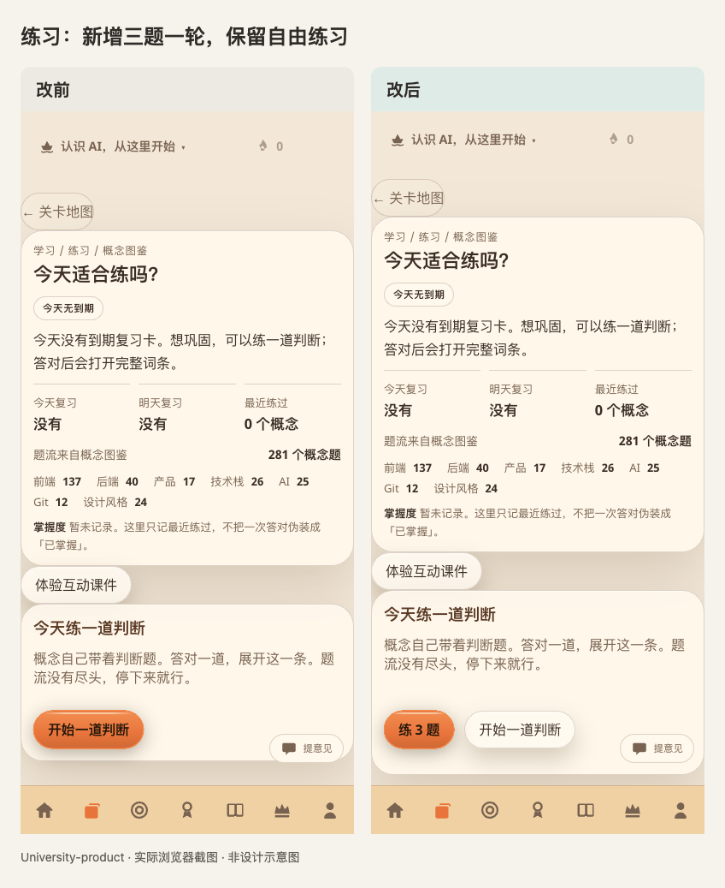

**原先没有、现在新增的页面：** 回合中显示“这一轮已完成 0 / 3 题”；完成三道不同题后，出现“这一轮就到这里”，可以今天停下、继续自由练习或再来一轮。

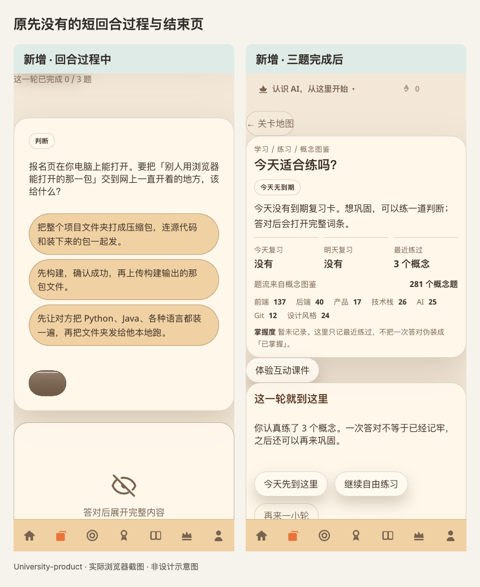

两张均来自隔离访客的实际选项点击与提交，演示中允许答错后重试，没有直接塞入“完成”数据。三题结束是一次练习完成，不是宣称已经永久记住三个概念。

## 08｜成长：原先叫排行榜，现在说清是和自己比

**位置：** 原来的“排行榜”入口，现在显示为“成长”。

**改前：** 入口和页面叫排行榜，但当前展示并不是一张真实用户之间的名次表，容易让人期待看到他人的排名。

**改后：** 名称改成“成长”，保留已有的记忆阶段和个人记录，并明确“不是真人排行榜”“和昨天的自己比”。没有编造其他学习者来陪跑。

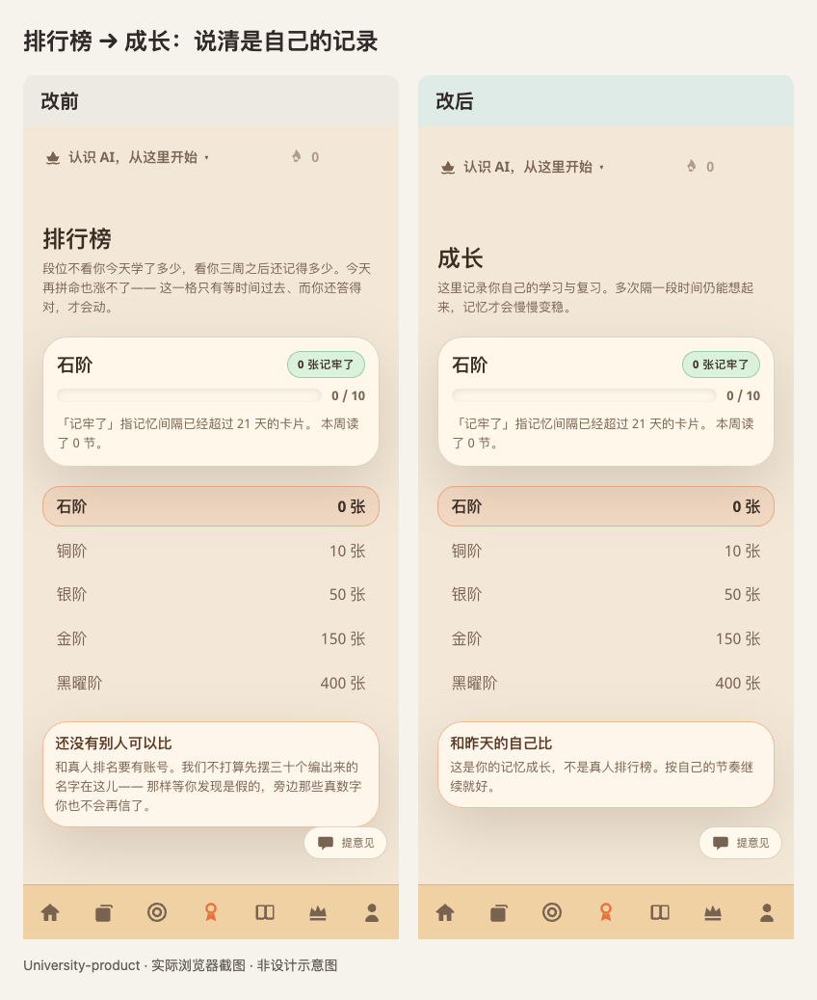

## 09｜个人档案：原先承诺过头，现在把学习身份和保存状态分开

**位置：** 个人档案，头像和等级下面。

**改前：** 大标题写“登录后跨设备同步”，容易被理解成只要登录就一定同步；下方还对所有人承诺“第一节里就有真实代码”，但认识 AI 的第一节并不是代码阅读课。

**改后：** 账号区域改为“保存你的学习身份”。新增一行实际保存状态，例如“已保存在这台设备。尚未同步到云端”；这个预览没接通账号服务，也直接说明不能保证跨设备恢复。零记录邀请改为“学一点，再用自己的话留下一张复习卡”。

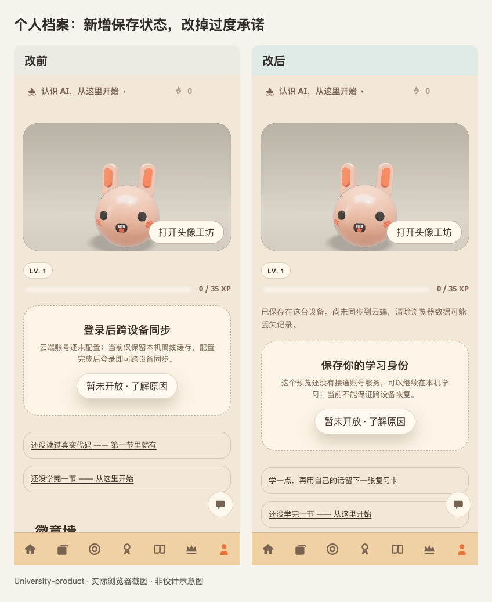

**新增位置就是右图等级条下面的那行文字。** 有真实代码阅读记录时，仍可显示相关统计；不是把编程学习能力删掉。是否能够同步仍取决于账号、服务连接和相应权益，不能仅凭这张图认定跨设备服务已验收。

## 10｜隐私与提醒：原先默认分享，现在先由用户决定

**位置：** 更多 → 设置，向下找到“一起学”和“复习提醒”。

**改前：** “让小组看到我在学什么”默认打开，说明也写着“默认开”。旧提醒入口在服务未接通的检查环境中仍能进入“正在设置提醒”的流程。

**改后：** 学习活动默认不分享，由用户主动打开；可以随时关闭。提醒服务没准备好时，明确说“现在不会申请通知权限”，并提示可以到练习里查看到期复习，不冒充已经安排好了明天的通知。

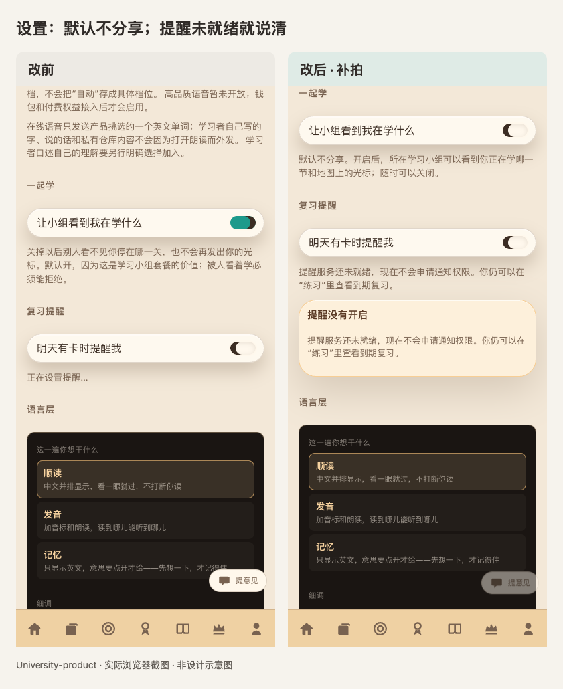

两张滚动到了同一组设置，具体滚动位置不同。左图的“正在设置”是原检查当时的状态；右图的服务未就绪说明不是提醒送达的证明。

## 11｜会员页面：原先先摆价格，现在先讲清能不能买、费用算什么

**位置：** 会员页面。

**改前：** 页面直接突出价格和“先登录”，没有在上方醒目说明当前尚未开售；开放辅导看起来也像已经包含在可买的服务中。年价的折合月价、会员费和额外批改费用之间不够清楚。

**改后：** 上方新增“会员尚未开售”，明确现在不会扣款。付费卡中补充“年付一次支付全年费用，折合月价只是比较”；明确会员费不包含钱包批改费用。尚未开放的辅导和语音另行说明，不再当作当下可买到的能力。

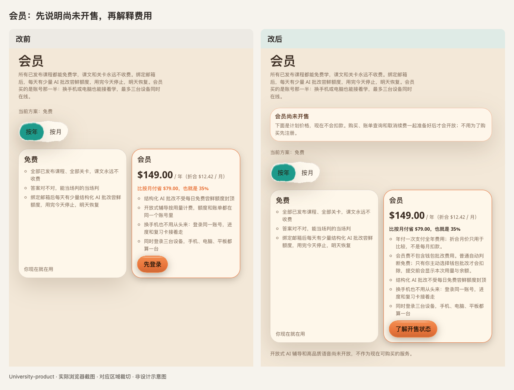

这张对照裁切了电脑页面中央的相同区域，便于看字。**本轮没有调整价格数值，也没有接通真实付款。** 月年按钮原来就有；这次修的是它与订单请求的对应关系，不能靠截图证明订单服务已经可用。

## 12｜点购买：原先先叫人登录，现在先承认还没开售

**位置：** 会员页的主按钮，点击后弹出的说明。

**改前：** 访客点击“先登录”后，被引导去登录。但当时即使登录，也没有可用的下单服务。

**改后：** 按钮改为“了解开售状态”。点开说明现在不会扣款、不会创建订单，并给出“继续学习”的出口。不再让人为了一个还买不到的服务先完成注册。

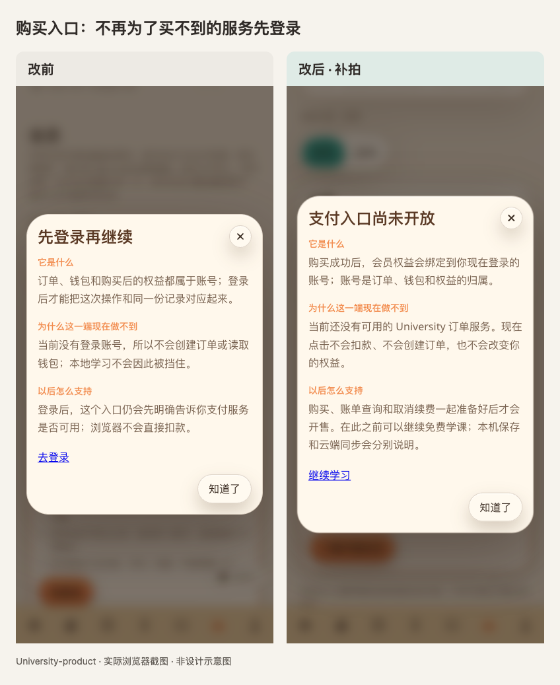

**并没有新增一套真的银行卡收款界面。** 购买、查单、停止续费必须一起准备好；当前未接通的能力没有用假成功画面补上。

## 画面之外，还改了哪些规则

这些属于运行规则，不会各长出一张新页面。没有真实账号、真实订单的现场截图，就不画一张假图当作验收。

| 场景 | 改前的问题或缺口 | 已改的规则 | 证据边界 |
| --- | --- | --- | --- |
| 切换账号 | 本机学习数据和正在返回的结果，存在串到另一身份的风险 | 本机缓存按账号隔离；发送答案前和结果返回时核对身份；输入框随身份切换 | 本地自动化测试，不是真实多人账号演示 |
| 保存失败 | 页面可能继续让人以为已经保住了内容 | 提示保存失败，保留页面内文字，提供重试；不能确认答案已保存时不直接清掉草稿 | 本地故障测试；不是说任意断电场景都不会丢 |
| 月付与年付 | 选择只影响展示，购买请求没带所选周期 | 请求带上周期，返回报价必须对应；检查总额和币种 | 客户端与模拟服务测试，真实订单服务未接通 |
| 付款请求超时、刷新 | 不能确定上一笔是否成功时，可能再生成一笔新请求 | 按账号保留订单编号，恢复查询，避免同一意图直接重下单 | 不替代服务端防重复扣款与真实对账 |
| 管理续费 | 只有下单能力存在时，也可能被显示成可以开售 | 下单、查单和订阅管理都具备，才允许打开购买；补好客户端管理入口与解释 | 真实停止续费、退款与到账仍未验收 |
| 无障碍 | 首页小字对比不足；同伴区域语义、主标题与顶部区域存在遗漏 | 调整相关文字色与页面结构，补上整页检查 | 有浏览器检查；不等于所有设备、所有读屏场景全部通过 |

上述规则的代码位置与测试收据，统一见 [实施与验收记录](../../../plans/active/product-completeness.md)。本文件只展示改动，不再维护第二份任务状态表。

## 这份对照没有冒充完成的事情

**没有把地图重新设计，也没有在这里重写课程。** 截图里的兔子、岛屿、课文、练习题内容和已有基础控件，不应全算作这次新增。

**没有完成真实付费、退款、取消续费、实体手机跨设备保存或次日通知送达。** 当前还保留课程互动格式与作者端读课程序的对齐问题，以及真实浏览器头像转向时间的待复核项。具体进展仍以实施记录为准，不把这份静态对照当成整体验收全绿。

## 图片从哪里来，文件怎么用

`before-after.md` 是这份对照的正文；`images/` 是正文使用的图片；`index.html` 是从同一正文生成的浏览器阅读版，不另写一套结论。移动或发送时，请保留整个文件夹，不要只拿走 MD 文件。

所有对照图均由真实截图并排排版；有局部裁切的已经说明，没有用 AI 生成画面冒充产品。改前对应代码基线 `cea753e2`，改后为该工作树尚未提交的实施结果。具体源文件、采集时间、尺寸与校验值见 [图片来源记录](image-manifest.json)。原始截图仍保留在 [原检查证据目录](../product-review-evidence/)。

原来的三轮问题检查见 [历史审查报告](../product-completeness-review.md)。它记录当初发现了什么；这份文件回答的是“后来实际改了什么”。
