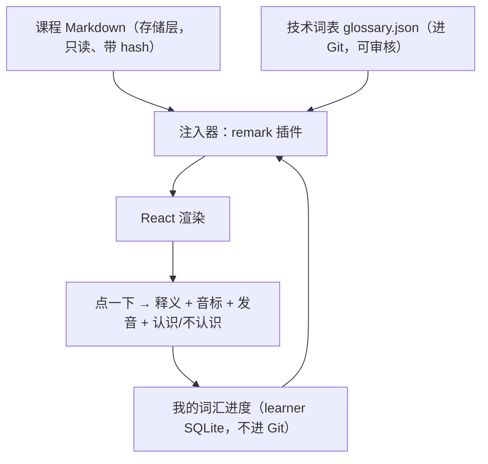

# 英文模式研究

一边读教程一边捡英文单词，点一下能看释义和读音，频率可调，学会了就换下一个词。
本文研究这件事在 UniversityLocal 现有架构里怎么做才不会把系统弄坏。

你已经拍板的两件事：**混合式**（生词先注释、熟词才替换）、**技术英语优先，通用
英语作为第二轨**。下面的设计以这两条为前提。

## 一、先说一条不能绕过的硬约束

课程内容不是普通 Markdown。每篇课文、每张卡片、每道练习都带着
`contentRevision` 和 `contentHash`（`src/domain/schemas.ts:236-238`、`:252-255`、
`:281-282`），而你的复习进度是按「内容第几版」记的——`StoredCardState` 里存着
`contentRevision`（`server/learning/types.ts:152-158`）。

**为什么这很要命：** 假设系统直接往课文里塞英文词，那么你每调一次频率、每学会一个
词，课文内容就变了，`contentHash` 就变了，`contentRevision` 就要 +1。而
`current-work.md` 的 Open Questions 里已经记着一个还没解决的问题：卡片跨内容版本
时，FSRS 排期会往前带，导致「一张排到很远的卡片要等到到期那天才会显示新文本」。
换句话说，**每次调频率都会在你的复习队列里制造一批内容和进度对不上的卡片**。

打个比方：课程内容是一本装订好、盖了骑缝章的书，你的复习卡背面写着「见第 47 页
第 3 行」。往正文里塞词等于重排重印，骑缝章全对不上。

**结论：英文词必须是一层贴在书上的便利贴。** 存储层的 Markdown 一个字节都不动，
英文词在**渲染的那一刻**才被贴上去。这一层可以随时开关、随时换频率、随时换词，
课程内容和复习进度完全不受影响。

## 二、架构：三层，互不污染

三层各自的性质完全不同，混在一起就是灾难：

| 层 | 存哪 | 进 Git 吗 | 谁能改 |
| --- | --- | --- | --- |
| 课程内容 | `studies/<study>/courses/**` | 否 | 只能通过 `course revise` |
| 词表 | `data/vocabulary/*.json`（项目内） | 是 | 人 + AI 提案，需要审核 |
| 词汇进度 | 学习者 SQLite | 否 | 只有你的点击 |

词表进 Git 是刻意的：它是**内容**，需要被 review、被 diff、被回滚。词汇进度不进
Git，因为它是**你的个人记录**，和现有的 `studies/` 一样属于隐私数据。

## 三、混合式怎么落地：一个词的三个阶段

你选的混合式，落到实现上就是每个词有三个状态，状态决定它长什么样：

| 阶段 | 长什么样 | 什么时候进入下一阶段 |
| --- | --- | --- |
| `introducing` 初见 | 「这份**快照（snapshot）**记录了…」中文在前，英文在括号里 | 你点开看过，并点了「认识了」≥ 2 次 |
| `practicing` 练习 | 「这份 **snapshot** 记录了…」直接替换 | 累计 ~10 次在阅读中被正确认出 |
| `known` 已掌握 | 仍然替换，但不再计数、不再高亮，只保留可点击 | 终点（除非你点了「其实不认识」，退回 practicing） |

**为什么是 10 次，不是 2 次或 3 次。** 这是有研究依据的：关于「附带词汇习得」
（incidental vocabulary acquisition）需要多少次接触，Uchihara、Webb 与 Yanagisawa
2019 年的元分析汇总了大量研究，各家给出的数字从 6 次到 20 次以上不等，Webb 2007
的实验支持 10 次左右能带来明显增益。**没有一个魔法数字**，但可以确定的是 2–3 次
远远不够——那只够你「见过」，不够你「记住」。

Webb 2008 还有一个对你这个场景特别重要的发现：**语境质量对「记住意思」的影响，
比接触次数更大**；接触次数主要影响的是「记住拼写形式」。这正好为你选的混合式背书
——第一次出现时把中文摆在旁边，就是把语境质量拉到最高。

## 四、频率怎么调：两个旋钮，不是一个

你说「频率需要可调节」。我建议**不要**做成一个「每屏出现几个英文词」的滑块，
理由是它会骗人：

> 假设你把滑块拉到「每屏 5 个词」。今天这一屏刚好都是你已经学会的词，5 个词形同
> 装饰；明天这一屏全是新词，5 个生词同时砸下来，你既没读懂课文也没记住单词。
> 同一个刻度，两天的实际难度差了一个数量级。

真正决定难度的不是「出现了几个英文词」，而是「其中有几个是你不认识的」。所以
建议两个旋钮：

- **旋钮 A：同时在学几个词**（`activeWordBudget`，比如 3 / 8 / 15）。这决定了
  `introducing` + `practicing` 状态的词一共有多少个。**这才是你说的「频率」的
  真身**——在学的词少，页面上蹦出来的生词自然就少。
- **旋钮 B：每屏最多注入几处**（`maxInjectionsPerScreen`，比如 2 / 4 / 8）。这是
  一个防溢出的上限，防止某一页刚好密集命中词表，读起来像被英文糊了一脸。

「学会一个就换下一个」也是这套机制自然的结果：一个词升到 `known`，
`activeWordBudget` 空出一个位置，队列里的下一个词自动补上。你不需要单独设计一个
「换词逻辑」。

## 五、词从哪来

### Track A：技术英语（你选的默认轨）

这一轨有一个别的方案都没有的优势：**词就在你正在读的东西里**。

课程原文和被引用的真实代码里，天然高频出现的词是：`commit` / `snapshot` /
`revision` / `evidence` / `stale` / `retire` / `schema` / `async` / `transaction` /
`idempotent` / `threshold` / `deterministic` / `coverage` / `dangling` /
`fingerprint` / `dependency` / `constraint` / `boundary`。

这批词的价值密度高得离谱：它们是你明天就用得上的英文——读报错、读文档、读 GitHub
issue、跟 AI 提需求。CET4 词表里的 `abandon` `abundant` 对你今天要做的事没有帮助，
而 `stale` 有：`refresh audit` 打印出来的每一行都在用这个词。

**词表怎么生成：** 由 AI 从课程原文和被引用文件里抽取候选词 → 人工/AI 复核 →
写成 `data/vocabulary/tech-en.json` 进 Git。这条路和项目现有的做法一致：
`course-proposals/` 就是「AI 出提案 → 机械门禁校验 → 人审 → 应用」的成熟流程，
而且已经证明有效（`current-work.md` 的 Zero-Basics Tier Receipt）。

**一个重要的边界：** 技术词表条目里的「中文对应词」必须是人工确认过的，不能靠
词典自动匹配。因为一词多义在技术语境里是常态——`commit` 在数据库里是「提交事务」，
在 Git 里是「一次提交」，在日常英语里是「承诺」。自动匹配会在这里出错，而且错得
很隐蔽。

### Track B：通用英语（第二轨，可切换）

数据源用 ECDICT（见第八节），按它自带的 `tag` 字段分级（zk/gk/cet4/cet6/ky/toefl/
ielts/gre）和 `frq`/`bnc` 词频排序取前 N 个。

**但我要指出这一轨的一个真实困难，而不是假装它很简单：** 通用英语词和技术教程的
中文句子之间没有语义关系。「这份快照记录了源码的状态」这句话里，你没法自然地塞进
`abundant`。硬塞的结果是句子读起来别扭，语境质量崩塌——而 Webb 2008 恰恰说了语境
质量是「记住意思」的主要因素。

所以 Track B 现实的做法只有两种：
1. 只注入那些**能自然对应**的通用词（`file` `open` `close` `change` `wait`
   `fail` `check` `build`）——它们和技术教程语境天然重合，实际上是 Track A 的低阶
   延伸；
2. 或者不做「注入」，只做一个独立的通用词复习面板，和阅读分开。

我的建议是先做 1，把 2 留到你真的想要考试词汇的时候再说。

## 六、发音：一个必须避开的坑

**方案：浏览器内置的 Web Speech API（`speechSynthesis`）。** 零依赖、零网络、
macOS 上有本地语音。

**坑在这里：** Chrome 会在语音列表里混进一批**云端语音**——调用它们会把你要读的
文本发到 Google 的服务器。这直接违反项目「permanently local-only」的边界，而且
和 `src/MarkdownContent.tsx:14-23` 那段刻意拦截外部图片的注释是同一个道理：那段
代码专门防止课程内容变成一个「页面信标」，结果从发音这个口子漏出去，就白防了。

**修法：** 每个 `SpeechSynthesisVoice` 有一个 `localService` 布尔字段，只挑
`localService === true` 的语音，找不到就把发音按钮置灰并说明原因，绝不静默降级。
这一条应该写成测试。

**不用外部词典 API 的理由同上**：Free Dictionary API、有道、Google TTS 全都要联网，
一律排除。

## 七、注入的技术实现

课文渲染的唯一入口是 `MarkdownContent`（`src/MarkdownContent.tsx:99`），课文在
`src/App.tsx:1008` 通过它渲染。注入器就挂在这里，做成一个 remark 插件。

**用 `mdast-util-find-and-replace`。** 它已经在依赖树里（`3.0.2`，经 `remark-gfm`
间接引入），需要提升为直接依赖才能合法 import。这是标准的 unified 生态做法，
不是自己造轮子。

它有两个正好对上的性质：

1. **代码块天然安全。** 它只处理 mdast 的 `text` 节点，而代码块（`code`）和行内
   代码（`inlineCode`）的内容存在自己的 `value` 字段里，根本不是 `text` 节点。
   所以「英文词被塞进代码里导致代码错了」这个最危险的情况，架构上就不可能发生。
2. **但链接和标题不安全。** `link` 节点里面装的是 `text` 子节点，会被改写。所以
   必须显式传 `ignore`，至少排除 `link` / `linkReference` / `definition` /
   `heading`。这个默认值是空的，不写就会出事。

**还要排除的：** 证据引文（课文里引用真实代码的段落）。改写引文等于伪造证据，
这是这个系统最不能碰的东西。

## 八、词典数据：ECDICT

| 项 | 事实 |
| --- | --- |
| 仓库 | `github.com/skywind3000/ECDICT` |
| 许可 | MIT（LICENSE 抬头：Copyright (c) 2025 Linwei） |
| Star | 8066 |
| 最后推送 | 2025-03-28（约一年半未更新） |
| 字段 | `word` `phonetic` `definition` `translation` `pos` `collins` `oxford` `tag` `bnc` `frq` `exchange` |
| `ecdict.csv` | 65.9 MB，约 77 万词条 |
| `lemma.en.txt` | 2.3 MB，词形还原表 |
| `ecdict.mini.csv` | 4 KB —— 这是样例，不是可用子集 |

**评估：**

- **许可** MIT，可用、可分发，需保留版权声明。
- **维护** 一年半没更新。对词典这类静态数据可以接受——`snapshot` 的意思不会变。
  但要如实记录，不要假装它是活跃项目。
- **来源** 作者自述整合了多份免费/开源资料。MIT 覆盖的是这个仓库本身。个人本地
  学习用途没有问题，但如果 UniversityLocal 未来要变成对外产品，这个来源链需要
  重新审。（项目边界文档已经写明未来的商业 `University` 是另一个仓库，所以现在
  不用解决这个问题，但要记着。）
- **体积** 65.9 MB 的 CSV **绝对不能进 Git**。

**建议的做法：** 一个构建期脚本，从 ECDICT 裁出「只包含词表里出现过的词」的小
JSON。第一阶段词表大概几百到一千五百个词，产出的数据文件在 200–400 KB 量级，
可以放心进 Git。不要一上来就裁「前 8000 高频词」——那是几 MB，而且其中绝大多数
永远不会出现在你的课程里。

**「本地优先」不等于「构建期也不能联网」。** 你 `pnpm install` 本来就在联网装包。
真正的边界是**运行时**：产品跑起来之后不能主动往外发请求。构建期一次性、由人发起、
有记录的数据引入是合规的，但按项目的 donor 政策（ADR-0004），它需要一份 donor map
记录许可、维护状态、安全、数据边界和技术栈契合度。

## 九、复习：你问「是单独的卡片吗」

**我的建议是：不要给英文词开第三条复习队列，也不要塞进现有的到期卡队列。**

先说为什么不能塞进现有队列。现有的复习卡有一条硬性契约：每张卡至少挂一条证据
（`src/domain/schemas.ts:284`），而且卡片的 key 是四段式
`course/unit/lesson/card` 或三段式 `knowledge/note/card`
（`server/learning/types.ts:114-130`）。一个英文单词**没有课程、没有课时、没有
证据**——它既过不了 schema，也套不进 key 的形状。硬塞进去要么放宽 schema（等于
拆掉整个系统最值钱的那条不变量），要么造假证据（更糟）。

再说为什么不要开第三条队列。因为**阅读本身就是复习**，这正好是你问的
「怎么强迫读者学懂但不破坏主进程体验」的答案：

- 每一次注入的词出现在你眼前，就是一次隐式测试。你读过去没停顿，就是认识；
  你停下来点开，就是不认识。
- 「认识 / 不认识」那两个按钮，就是评分。不需要额外的复习会话。
- 只有**反复失败**的词（比如连续 3 次点开还是要看释义）才升级成一张真正的
  待复习条目，进一个**独立的小队列**——不和课程卡混。

这样设计的结果是：**正常情况下你从来不需要「复习单词」这个动作**，因为复习发生在
你本来就要做的阅读里。只有卡住的词才需要额外注意力，而那时候额外的打断是值得的。

**存储建议：** 在现有的学习者 SQLite 里加一组 `vocab_*` 表，直接用已经在依赖里的
`ts-fsrs 5.4.1` 做调度，但**不要**复用 `review_event` 那条 append-only 日志。
那条日志的每一行都绑着 `content_revision`（课程内容第几版），而单词没有内容版本
概念。混进去会让「从事件日志重建卡片投影」这个已经建立起来的不变量变得说不清。

## 十、两点我建议你重新考虑的地方

你让我有独立判断，这两条是我认为你的方案里值得再想想的：

### 第一：英文模式默认只在「重读 / 复习」时开，第一遍读课文时不开

**理由是认知负荷。** 你现在处在零基础阶段，98 节课都在教你「什么是函数」「什么是
异步」。这时候读一句话，你的注意力已经全部用在「这句话在讲什么」上了。这时候再
塞一个英文生词，就是让同一份注意力同时干两件事——教育心理学里管这叫「注意力分散
效应」（split-attention effect），典型结果是**两件事都没学好**。

打个比方：这就像一边学开车一边背单词。不是不能干，是这两件事都值得你专心。

**建议：** 课文第一次读，纯中文，专心搞懂概念；这节课完成之后再回头重读或复习时，
英文模式自动生效。这时候内容你已经懂了，注意力有余量，英文词才真的进得去——而且
你重读时对句意的理解，正好是最高质量的语境。

这一条是建议，不是反对。如果你觉得自己英文底子够好、能同时处理，把它做成一个开关
（「第一遍就开英文」）也行。但默认值我强烈建议是「第一遍不开」。

### 第二：别把「学英语」和「学技术」的进度混在一张进度条上

如果首页出现「今日：3 节课 + 12 个单词」，你会本能地想把数字清零。那时候单词就
从「顺手捡的」变成「今天的任务」，主进程被喧宾夺主。

**建议：** 单词不出现在「今日学习」的任务数里。给它一个很轻的角落——比如
「这周你顺手认识了 14 个词」，可点开看列表。**成就展示，不是待办清单。**

## 十一、捐赠者调研

按 ADR-0004 的 donor-first 要求，这里记录调研结果。**没有任何一个捐赠者会被整体
移植**，只吸收模式。

| 捐赠者 | 类型 | 许可/性质 | 吸收什么 | 为什么不能直接用 |
| --- | --- | --- | --- | --- |
| Toucan（Babbel 收购） | 商业浏览器扩展 | 闭源 | 「在你本来就要读的东西里换词」这个核心交互被市场验证过 | 闭源、云端、只做替换不做注释 |
| Vocabo | 商业扩展 | 闭源 | 同上，且证明这个品类有持续需求 | 同上 |
| VocabMeld / Lingrove | 开源扩展 | MIT | 三个具体机制：**替换强度按段落百分比而非固定词数**、**CEFR 分级门槛**、**已学会/待记忆两个词表分离** | 依赖 LLM 在阅读时实时调用（OpenAI/DeepSeek/Ollama），与本项目 local-only 边界冲突；且它改的是任意网页，我们改的是有 hash 的课程内容 |
| ECDICT | 数据 | MIT | 释义、音标、考纲标签、词频 | 需裁剪，见第八节 |
| ts-fsrs | 库 | 已是本项目依赖 | 间隔调度 | 直接复用 |
| `mdast-util-find-and-replace` | 库 | 已在依赖树 | AST 安全替换 | 提升为直接依赖即可 |
| Web Speech API | 浏览器能力 | 无 | 发音 | 需过滤 `localService`，见第六节 |
| SwimmerUIKit | 本组合依赖 | 1.2.0 | `GameTooltip`（词卡弹层）、`GameSlider`（频率）、`GameToggle`（开关）、`GameSegmentedControl`（轨道切换） | 直接复用，符合项目「优先复用 SwimmerUIKit」的规则 |

**结论：这个功能不需要任何一个新的运行时依赖去做「核心逻辑」**——注入用已有的
unified 生态，调度用已有的 ts-fsrs，UI 用已有的 SwimmerUIKit，发音用浏览器自带。
唯一的新东西是**数据**（词表 + 裁剪后的词典），而数据是可以审核、可以 diff 的。

## 十二、风险清单

| 风险 | 严重度 | 缓解 |
| --- | --- | --- |
| 发音走了 Chrome 云端语音，泄露课程文本 | 高 | 强制 `localService === true`，写测试 |
| 注入改写了链接文本或标题，破坏导航 | 中 | 显式 `ignore`，写测试覆盖 link/heading |
| 注入改写了证据引文，等于伪造证据 | 高 | 引文段落整体排除，写测试 |
| 中英对应词错误（一词多义） | 中 | 词表人工确认，不允许词典自动匹配 |
| 认知负荷压垮主线学习 | 中 | 默认第一遍不开；两个旋钮而非一个 |
| 词表膨胀到无法审核 | 中 | 第一阶段硬上限（比如 300 词），先跑通再扩 |
| ECDICT 数据太大误入 Git | 中 | 构建期裁剪，`.gitignore` 原始 CSV |
| 单词变成 KPI，喧宾夺主 | 低 | 不进「今日」任务数 |

## 十三、分阶段建议

**阶段 0（最小可用，约完整版的十分之一工作量）**
只让课文里**已经存在**的英文词可点击：弹层显示释义 + 音标 + 发音。不新增任何词、
不改任何内容、不做频率、不做进度。

价值不只是「便宜」——它会产出真实数据：**你实际上会点哪些词**。这批点击记录是校准
`activeWordBudget` 和词表优先级的最好依据，比任何猜测都准。

**阶段 1** 加词汇进度（三阶段状态机）+ 混合式注入 + 两个旋钮 + 总开关（默认关）。
词表限定 Track A，硬上限 300 词。

**阶段 2** 加「反复失败才进队列」的小复习面板 + 「这周认识了几个词」的展示。

**阶段 3** 再考虑 Track B 通用英语，且优先做第五节说的「能自然对应」的那一类。

## 十四、待决问题

1. **第一遍读课文要不要开英文模式？** 我建议默认关（第十节第一条），但这直接影响
   你的体验，需要你定。
2. **「认识 / 不认识」之外，要不要一个「不确定」？** 三档评分对 FSRS 更友好，
   但多一个按钮就多一次决策成本。倾向：先做两档。
3. **一个词在同一页出现多次，要不要每次都注入？** 倾向：同一页只注入第一次
   （避免视觉噪音），但计数按实际出现次数算。需要验证读起来的手感。
4. **词表的第一批 300 个词由谁定？** 建议 AI 从现有 120 节课的原文里按词频抽取
   候选，你审一遍。这一步需要一个提取脚本。
5. **`data/vocabulary/` 放在项目根还是 `src/` 下？** 涉及构建配置，实现时再定。
